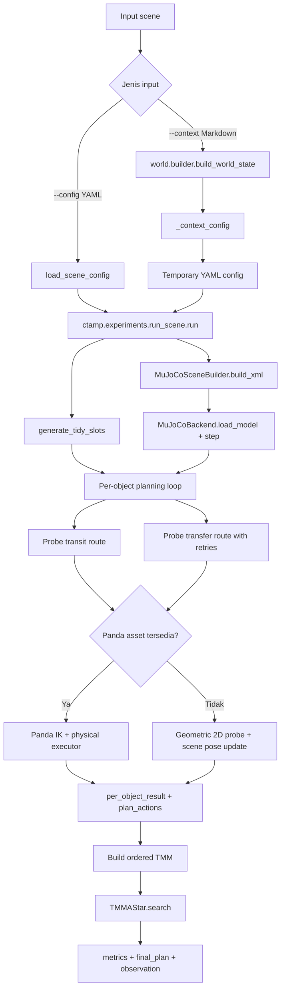
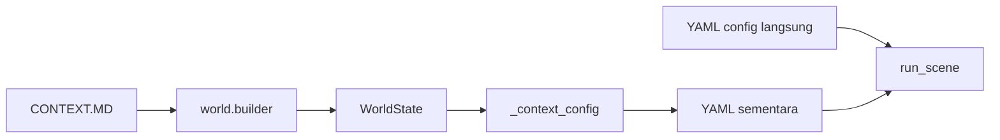
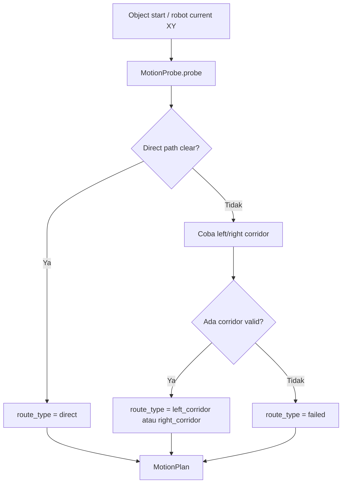
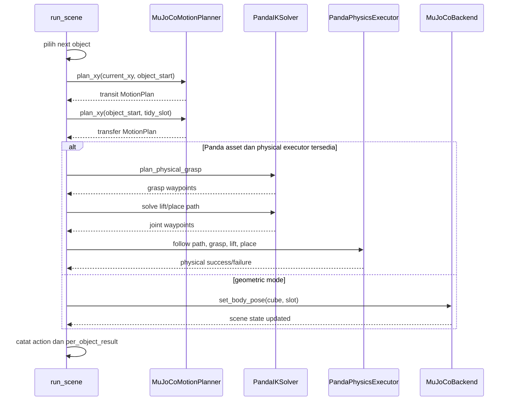
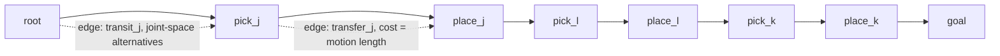
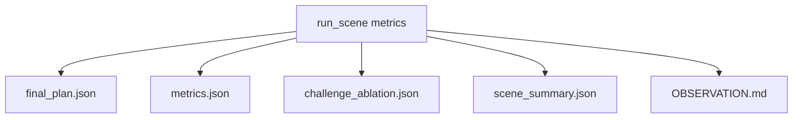

# CTAMP Robot

Target repo now uses the migrated `ctamp` pipeline from `ctamp_learned_heuristic`.

The current runtime is centered on grouped-tidy tabletop alignment: scattered red/blue cubes are moved into ordered color lanes while preserving obstacles such as a frontal wall. The pipeline accepts either a YAML scene config or a `CONTEXT.MD`-style markdown scene, turns it into a normalized scene config, probes feasible routes, optionally validates Panda IK/physical execution in MuJoCo, searches the resulting Task-Motion Multigraph (TMM), then writes run artifacts.

Main flow:

1. Read scene YAML directly, or read `CONTEXT.MD` through the adapter in `cli.run_simulation`.
2. Build grouped tidy slots, MuJoCo XML, and MuJoCo scene state.
3. For every target object, choose the next object, probe transit and transfer routes, retry failed transfer probes, and optionally validate Panda IK plus physical pick/place execution.
4. Build an ordered Task-Motion Multigraph from attempted objects and motion results.
5. Run TMM A* search over that graph.
6. Write `final_plan.json`, `metrics.json`, `challenge_ablation.json`, `scene_summary.json`, and `OBSERVATION.md`.

Commands:

```bash
python -m cli.run_simulation --context contexts/examples/align_grouped_tidy_wall_world.md --output runs/example
python -m cli.run_simulation --config configs/scenes/align_grouped_tidy_wall_world.yaml --output runs/example_yaml
python -m cli.generate_plan --context contexts/examples/align_grouped_tidy_wall_world.md --output task_plans/generated
```

Old TaskPlan/OMPL/adaptive-cache runner was removed. Use `ctamp.*` modules for learning, planning, cost, search, and TMM.

## Workflow Pipeline End-to-End

Bagian ini menjelaskan cara kerja pipeline dari input sampai output dengan bahasa sederhana.

Bayangkan pipeline ini seperti proses kerja operator robot:

1. **Baca instruksi meja kerja.** Sistem membaca daftar objek, posisi objek, ukuran meja, posisi robot, obstacle, dan target akhir.
2. **Tentukan tempat rapi.** Sistem membuat slot tujuan untuk setiap kubus berdasarkan warna dan grup.
3. **Bangun dunia simulasi.** Sistem membuat scene MuJoCo dari config dan asset robot.
4. **Cari jalur tiap kubus.** Sistem mengecek apakah robot bisa bergerak dari posisi saat ini ke kubus, lalu dari kubus ke slot tujuan.
5. **Validasi gerakan robot.** Jika asset Panda lengkap tersedia, sistem mencoba IK, jalur joint, grasp, lift, place, dan pelepasan kubus.
6. **Rangkai graf task-motion.** Setiap objek menjadi urutan `transit -> pick -> transfer -> place`; urutan itu dimasukkan ke TMM.
7. **Cari solusi TMM.** A* memilih jalur dengan cost paling masuk akal dari root sampai goal.
8. **Tulis hasil.** Sistem menyimpan plan, metrics, ringkasan scene, ablation challenge, dan observasi.

### Diagram Ringkas



### Input Pipeline

Pipeline bisa dimulai dari dua bentuk input:

- `--config`: file YAML yang sudah berisi data scene final, misalnya `configs/scenes/align_grouped_tidy_wall_world.yaml`.
- `--context`: file markdown gaya `CONTEXT.MD`, misalnya `contexts/examples/align_grouped_tidy_wall_world.md`.

Jika memakai `--context`, `cli.run_simulation._context_config()` akan memanggil `world.builder.build_world_state()` untuk memvalidasi isi markdown, lalu mengubahnya menjadi struktur config yang sama dengan YAML. Setelah itu, pipeline tetap berjalan lewat jalur yang sama: `ctamp.experiments.run_scene.run()`.



Data penting yang dibaca dari input:

- `scene`: identitas scene dan varian.
- `table`: batas area kerja meja dan area goal.
- `robot`: posisi base, batas reach, dan kapabilitas.
- `objects`: daftar kubus, warna, pose awal, dan reachability.
- `obstacles`: obstacle seperti wall, ukuran, dan pose.
- `task`: nama task dan urutan target objek.
- `grouped_tidy` + `tidy_groups`: aturan pembuatan slot akhir per warna/grup.
- `physical_execution`: aturan eksekusi fisik jika validasi Panda aktif.
- `challenge`: metadata skenario obstacle-aware.

### Slot, Scene, dan Motion Probe

Setelah config siap, `run_scene` membuat slot tujuan dengan `generate_tidy_slots(config)`. Slot dibuat berdasarkan `tidy_groups`, `axis`, `spacing`, dan posisi `center` setiap grup. Jadi setiap kubus punya alamat akhir yang eksplisit, bukan hanya "rapikan ke area goal".

Lalu `MuJoCoSceneBuilder` membangun XML scene dan `MuJoCoBackend` memuat scene tersebut. Untuk route planning awal, `MuJoCoMotionPlanner.plan_xy()` memakai `MotionProbe`:

- Cek jalur langsung dari titik awal ke titik tujuan.
- Jika jalur langsung terhalang obstacle, coba koridor samping di sekitar obstacle yang sudah diberi clearance.
- Pastikan titik tetap berada di batas meja dan dalam reach robot.
- Kembalikan `MotionPlan` berisi `success`, `route_type`, `waypoints`, `length`, dan metadata validasi.



### Loop Per Objek

Pipeline tidak langsung menganggap semua objek bisa dipindahkan. Ia memproses target satu per satu:

1. Ambil daftar `target_objects` dari config.
2. Pilih objek berikutnya dengan scoring route: transit + transfer yang lebih pendek dan lebih feasible lebih diprioritaskan.
3. Probe `transit`: dari posisi robot saat ini ke posisi objek.
4. Probe `transfer`: dari posisi objek ke slot tujuan.
5. Retry transfer sampai `max_retries_per_object` jika probe gagal.
6. Jika Panda IK tersedia, validasi grasp, lift, place, dan return path.
7. Jika Panda IK tidak tersedia penuh, validasi tetap dicatat sebagai geometric 2D probe dan pose kubus disinkronkan di scene.
8. Simpan hasil objek ke `per_object_result`; jika berhasil, tambahkan action ke `plan_actions`.



### TMM dan A* Search

Setelah loop objek selesai, pipeline membangun TMM ordered branch dengan `_build_ordered_tmm(attempted_objects, motions)`.

Maknanya:

- Ada vertex awal `root`.
- Untuk setiap objek dibuat vertex `pick_<object_id>` dan `place_<object_id>`.
- Edge `transit_<object_id>` menghubungkan posisi sebelumnya ke pick.
- Edge `transfer_<object_id>` menghubungkan pick ke place.
- Setiap edge punya alternatif joint space, misalnya `left_arm` dan `left_arm_redundant`.
- Cost transfer diambil dari panjang motion jika motion sukses; jika gagal diberi cost sangat besar.
- Di akhir ada vertex `goal`.

Setelah graf jadi, `TMMAStar().search(tmm)` mencari jalur dari `root` ke `goal` berdasarkan akumulasi cost edge.



### Output yang Dihasilkan

Setiap run menulis beberapa file ke folder `--output`:

- `final_plan.json`: status sukses, completion ratio, dan daftar action yang bisa dijalankan.
- `metrics.json`: ringkasan lengkap, jumlah objek, slot, obstacle, TMM vertices/edges, expanded vertices, elapsed time, total cost, dan hasil per objek.
- `challenge_ablation.json`: ringkasan efek obstacle-aware routing, termasuk jumlah segment direct-only yang terblokir dan jumlah corridor route yang dipakai.
- `scene_summary.json`: ringkasan scene, objek, slot, obstacle, dan status asset robot.
- `OBSERVATION.md`: narasi hasil run, klasifikasi evidence, dan technical debt.



### Cara Membaca Hasil

Gunakan `metrics.json` untuk melihat apakah run benar-benar berhasil:

- `solution_found`: hasil akhir pipeline. `true` berarti completion policy terpenuhi dan TMM search menemukan goal.
- `all_objects_solved`: apakah semua objek berhasil dipindahkan.
- `completion_ratio`: persentase objek yang berhasil.
- `completion_policy`: aturan penerimaan, misalnya `strict` atau `best_effort`.
- `per_object_result`: diagnosis per objek, termasuk route, retry, IK, reach, grasp, dan placement.
- `validation_level`: tingkat validasi yang benar-benar terjadi pada run tersebut.

Poin penting: `solution_found` bukan hanya "ada daftar action". Nilai ini juga bergantung pada policy completion dan hasil search TMM. Untuk debugging, mulai dari `failed_objects`, lalu baca detail objek gagal di `per_object_result`.

### Batasan Runtime Saat Ini

Runtime saat ini bukan lagi runner TaskPlan/OMPL/adaptive-cache lama. Alur utama di README ini mengikuti pipeline migrated `ctamp.*`.

Beberapa hal tetap perlu dibedakan:

- Motion probe awal adalah validasi geometrik 2D di bidang meja.
- Jika asset Panda real terdeteksi, pipeline mencoba validasi IK 7-DOF, collision-aware path, grasp, lift, dan place.
- Jika validasi fisik tidak lengkap, output tetap menyebutkan level validasi agar pembaca tidak mengira semua action sudah terbukti aman secara fisik penuh.
- Modul learning, cost, symbolic planning, search, dan TMM tersedia di `ctamp.*`, tetapi jalur `run_scene` saat ini memakai ordered grouped-tidy scene adapter sebagai orchestrator utama.
