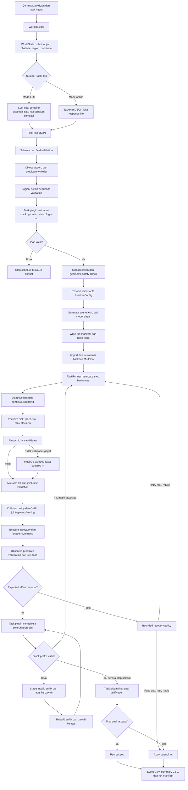

# CTAMP Robot Framework

## Pipeline end-to-end



## TaskPlan Aktif

Artefak task yang dipertahankan:

- `task_plans/examples/ungroup_obs_stack_cubes.json`
- `task_plans/examples/ungroup_obs_pyramid_cubes.json`
- `contexts/examples/align_grouped_tidy_wall_world.md`
- `task_plans/examples/align_grouped_tidy_wall_world.json`

## Report Alur Kerja Framework

### Ringkasan Eksekutif

Framework ini dibagi menjadi dua fase utama: **Plan Generation** dan
**Simulation Execution**. Fase Plan Generation bertanggung jawab mengubah
context menjadi TaskPlan JSON yang valid secara simbolik. Fase Simulation
Execution membaca TaskPlan tersebut, membangun target fisik, menjalankan robot
di MuJoCo, lalu membuktikan hasilnya melalui pose object yang teramati dari
simulator.

Pembagian proses:

```text
Fase 1 - Plan Generation
context .md
  -> WorldState
  -> LLM call atau response-file
  -> TaskPlan JSON
  -> typed TaskPlan object
  -> schema/object/predicate/sequence/plugin validation
  -> saved TaskPlan JSON

Fase 2 - Simulation Execution
TaskPlan JSON
  -> WorldState dan TaskPlan dibaca ulang
  -> slot allocation
  -> runtime config dan MuJoCo scene
  -> backend import setelah validation gate
  -> TaskRunner step-by-step execution
  -> observed predicate verification
  -> event CSV, summary CSV, dan run manifest
```

### Fase 1 - Plan Generation

#### 1. Context Dibaca Menjadi WorldState

File context seperti `contexts/examples/ungroup_obs_pyramid_cubes.md`
menyimpan fakta scene: table, robot, object, obstacle, task, dan constraints.
Context ini tidak hanya menjadi prompt untuk LLM, tetapi juga menjadi sumber
fakta deterministic untuk validasi.

Bukti kode ada di `world/builder.py`:

```python
text = context_path.read_text(encoding="utf-8")
sections = _parse_markdown(text)
scene = _required_map(sections, "scene", {"scene_id", "variant"})
table = _required_map(sections, "table", {"x_range", "y_range", "z_top", "goal_center"})
task = _required_map(sections, "task", {"name", "target_objects", "description"})
```

Kontribusi file:

- `contexts/examples/*.md`: sumber fakta task dan prompt contract untuk LLM.
- `world/builder.py`: parser context Markdown dan validator fakta world.
- `world/state.py`: dataclass immutable untuk object, obstacle, dan world.

Titik ekstensibilitas:

- Tambah scene/task baru dengan membuat context baru.
- Tambah field context bisa dilakukan di `world/builder.py`, tetapi harus ikut
  dijadikan bagian dari `WorldState` agar tetap typed dan mudah dites.

#### 2. Generate Plan Membaca Context dan Menghasilkan JSON

Perintah `python -m cli.generate_plan` adalah tahap planner. Ia membaca context,
lalu memakai salah satu dari dua sumber JSON: response mentah LLM via
`--response-file`, atau panggilan LLM langsung dari environment.

Bukti kode ada di `cli/generate_plan.py`:

```python
world = build_world_state(args.context)
context_text = args.context.read_text(encoding="utf-8")
if args.response_file:
    payload = parse_llm_json(args.response_file.read_text(encoding="utf-8"))
else:
    payload = request_task_plan(context_text, LLMSettings.from_env())
```

Prompt LLM berada di `task_planning/generator.py`. LLM hanya boleh menghasilkan
TaskPlan JSON, bukan joint angle, trajectory, atau IK:

```python
SYSTEM_PROMPT = """Kamu adalah task planner untuk robot manipulasi meja Franka Panda.
...
3. Jangan tentukan joint angles, trajectory, atau pose IK.
7. Output harus JSON valid. Tidak ada Markdown. Tidak ada komentar.
"""
```

Kontribusi file:

- `cli/generate_plan.py`: orkestrator generate/validasi/simpan TaskPlan.
- `task_planning/generator.py`: adapter provider LLM dan parser response JSON.
- `.env.example`: template konfigurasi provider/model/key untuk LLM.

Titik ekstensibilitas:

- Provider LLM baru bisa ditambahkan di `task_planning/generator.py`.
- Mode offline benchmark cukup memakai `--response-file`, sehingga framework
  bisa membandingkan output banyak model tanpa memanggil API lagi.

#### 3. JSON LLM Dikonversi Menjadi TaskPlan Typed Object

LLM menghasilkan JSON biasa. Framework lalu mengubah JSON itu menjadi object
typed supaya field, tipe data, dan struktur step bisa dicek sebelum simulator
dibuka.

Bukti kode ada di `task_planning/loader.py`:

```python
required = {
    "schema_version",
    "task",
    "scene_id",
    "target_objects",
    "goal_predicates",
    "slot_config",
    "steps",
}
_reject_unknown(data, required | {"constraints"}, "plan")
```

Struktur datanya ada di `task_planning/types.py`:

```python
@dataclass(frozen=True)
class Step:
    step_id: int
    action: Literal["pick", "place", "stack_place"]
    object: str
    slot: str | None = None
    on_top_of: str | None = None
```

Kontribusi file:

- `task_planning/types.py`: kontrak utama `TaskPlan`, `Step`, dan `SlotConfig`.
- `task_planning/loader.py`: strict JSON-to-dataclass conversion.
- `task_plans/examples/*.json`: TaskPlan siap pakai atau output model yang
  sudah disimpan sebagai artefak benchmark.

Titik ekstensibilitas:

- Action baru perlu ditambahkan ke `ALLOWED_ACTIONS`, `Step`, plugin task, dan
  primitive executor.
- Field JSON baru harus sengaja didaftarkan di loader. Field asing ditolak agar
  output LLM tidak diam-diam mengubah kontrak.

#### 4. TaskPlan Divalidasi Sebelum Disimpan

Plan yang sudah typed tidak langsung dijalankan. Ia melewati validation gate
umum dan validation task-specific. Ini penting karena plan bisa valid JSON tetapi
masih salah secara task, misalnya slot tidak sesuai atau object tidak ada.

Bukti kode ada di `task_planning/validator.py`:

```python
def validate(plan, world_object_ids, allowed_predicates=None) -> None:
    _gate_1_schema(plan)
    _gate_2_object_whitelist(plan, world_object_ids)
    _gate_3_predicate_whitelist(plan, allowed_predicates)
    _gate_4_action_sequence(plan)
```

Untuk Pyramid, validasi khusus ada di `plugins/pyramid_task.py`:

```python
if len(plan.steps) != len(plan.target_objects) * 2:
    raise PlanValidationError(
        "pyramid plan must contain exactly one pick/place pair per cube"
    )
```

Kontribusi file:

- `task_planning/validator.py`: gate schema, object whitelist, predicate
  whitelist, dan sequence logic.
- `plugins/stack_task.py`: aturan tower, dependency `stack_place`, dan rebuild
  semantics.
- `plugins/pyramid_task.py`: aturan build order 3-2-1, slot row/col, dan goal
  predicate pyramid.
- `plugins/registry.py`: discovery plugin `*_task.py` yang trusted dan
  deterministic.

Titik ekstensibilitas:

- Task baru ditambahkan sebagai plugin baru, misalnya `plugins/new_task.py`,
  dengan export `PLUGIN`.
- Plugin harus mengikuti kontrak `plugins/protocol.py`: `validate_plan`,
  `make_slot_config`, `configure_runtime`, `assess_progress`, dan `verify_goal`.

### Fase 2 - Simulation Execution

#### 5. Run Simulation Membaca JSON, Bukan Memanggil LLM

`python -m cli.run_simulation` berbeda dari generate plan. Tahap ini membaca
TaskPlan JSON yang sudah ada, membaca context lagi, lalu menjalankan simulasi.
LLM tidak dipanggil pada tahap ini.

Bukti kode ada di `cli/run_simulation.py`:

```python
world = build_world_state(args.context)
plan = load_plan(args.plan)
validate(plan, world.all_object_ids(), world.allowed_predicates)
plugin.validate_plan(plan, world)
```

Setelah itu framework menghitung slot target dari `slot_config`:

```python
slot_config = plugin.make_slot_config(plan, world)
slots = allocate_slots(slot_config, len(plan.target_objects))
```

Kontribusi file:

- `cli/run_simulation.py`: entrypoint eksekusi end-to-end.
- `world/slot_allocator.py`: mengubah slot symbolic menjadi koordinat target.
- `configuration/*`: memilih dan memvalidasi runtime tuning.
- `scene/builder.py`: membuat XML scene MuJoCo dari context.

Titik ekstensibilitas:

- Runtime tuning bisa ditambah lewat TOML di `configuration/profiles/runtime/`.
- Model robot bisa diganti lewat profile model, selama backend primitive masih
  memenuhi kontrak yang sama.

#### 6. Slot Target Dihitung dari slot_config

Slot pada JSON masih symbolic, misalnya `row1_col0` atau `tower_base`.
`world/slot_allocator.py` mengubahnya menjadi `(x, y, z)`.

Untuk Pyramid:

```python
z = config.base_z + row * config.layer_height_m
slots[f"row{row}_col{column}"] = (
    start_x + column * config.spacing_m,
    y,
    z,
)
```

Slot lalu dicek terhadap table, reach robot, goal area, dan obstacle buffer:

```python
if z < world.table_z_top:
    raise SlotAllocationError(...)
```

Kontribusi file:

- `world/slot_allocator.py`: allocation untuk `tower` dan `pyramid`.
- `configuration/types.py`: sumber tolerance dan safety config yang dipakai
  saat validasi slot.

Titik ekstensibilitas:

- Bentuk slot baru bisa ditambahkan di `allocate_slots`.
- Safety check tambahan bisa dimasukkan di `validate_slots`, misalnya batas
  jarak antar target, zona forbidden baru, atau task-specific clearance.

#### 7. Runtime Config dan Scene MuJoCo Dibuat

Setelah plan dan slot valid, framework memilih runtime profile, menerapkan
policy task-specific dari plugin, lalu membuat XML scene MuJoCo dari context
yang sama. Dengan cara ini, scene simulator tetap sinkron dengan context yang
dipakai LLM dan validator.

Bukti kode pemilihan runtime ada di `cli/run_simulation.py`:

```python
profile_name = args.runtime_profile
if profile_name == "auto":
    profile_name = "conservative" if world.variant.endswith("_no_obs") else "obstacle"
runtime_config = load_runtime_config(...)
runtime_config = plugin.configure_runtime(plan, world, runtime_config).validate()
```

Scene XML dibuat dari context:

```python
scene_file = prepare_scene_variant(
    world.variant,
    base_model_file=runtime_config.model.xml_path,
    object_states=world.objects,
    obstacle_states=world.obstacles,
)
```

Kontribusi file:

- `scene/builder.py`: generate XML scene dari base model dan context.
- `models/panda.xml`: base robot/world MuJoCo.
- `assets/`: mesh visual/collision untuk Panda.
- `configuration/types.py`: schema typed untuk runtime config.
- `configuration/loader.py`: loader TOML dan strict overlay runtime profile.

Titik ekstensibilitas:

- Scene variant baru bisa ditambahkan di `scene/builder.py`.
- Runtime profile baru bisa ditambah tanpa menyentuh runner, selama schema TOML
  sesuai `configuration/types.py`.

#### 8. Backend MuJoCo Diimport Setelah Semua Gate Lolos

Framework sengaja menunda import backend MuJoCo sampai semua gate deterministic
lolos. Tujuannya agar error JSON/context muncul cepat tanpa membuka viewer atau
native simulator.

Bukti kode ada di `cli/run_simulation.py`:

```python
manifest_path = write_run_manifest(...)
activate_runtime_config(runtime_config)

# import it only after every deterministic validation gate has passed.
from backends.mujoco import runtime
```

Kontribusi file:

- `configuration/runtime.py`: mengaktifkan resolved runtime config sebelum
  backend native diimport.
- `telemetry/run_manifest.py`: menyimpan provenance plan, context, config, dan
  hash file.
- `backends/mujoco/runtime.py`: backend native MuJoCo yang baru dibuka setelah
  semua validation gate selesai.

Titik ekstensibilitas:

- Backend lain dapat ditambahkan selama import-nya tetap berada setelah gate
  deterministic.
- Run manifest dapat diperluas untuk mencatat metadata benchmark tambahan.

#### 9. TaskRunner Menjalankan Step Satu per Satu

Setelah backend siap, `TaskRunner` menerima plan, world, slots, primitive
adapter, verifier, recovery policy, dan event log. Runner generik; ia tidak
hardcode semua detail task. Semantik task tetap hidup di plugin.

Bukti kode ada di `execution/runner.py`:

```python
for step in self.plan.steps:
    result = self._execute_step(step)
```

Untuk setiap step, target di-resolve dari slot:

```python
target = self.slots.get(step.slot or "")
```

Untuk Pyramid layer atas, runner bisa membaca posisi support aktual dari MuJoCo
lalu menghitung ulang target live:

```python
left_support, right_support = (
    self.primitives.object_pose(support_ids[0]),
    self.primitives.object_pose(support_ids[1]),
)
resolved = (
    (left_support[0] + right_support[0]) / 2.0,
    (left_support[1] + right_support[1]) / 2.0,
    max(left_support[2], right_support[2]) + layer_height,
)
```

Kontribusi file:

- `execution/runner.py`: loop step, target resolution, retry/recovery, final
  goal check.
- `execution/recovery.py`: bounded retry, replan-required, dan abort policy.
- `backends/adaptive/hint_cache.py`: preference historis untuk IK/grasp, tanpa mengubah
  goal atau safety.

Titik ekstensibilitas:

- Recovery policy bisa diperluas untuk task baru, tetapi tidak boleh memanggil
  LLM atau melonggarkan safety diam-diam.
- Runner bisa menerima backend lain selama backend tersebut memenuhi protocol
  `PrimitiveExecutor`.

#### 10. Primitive Adapter Menghubungkan Runner ke MuJoCo

Runner tidak memanggil MuJoCo langsung. Ia memanggil interface primitive:
`pick`, `place`, atau `stack_place`. Adapter ini menerjemahkan step symbolic ke
fungsi backend MuJoCo.

Bukti kode ada di `execution/primitives.py`:

```python
if step.action == "pick":
    self.executor.pick(step.object)
elif step.action == "place":
    self.executor.place(
        target[0],
        target[1],
        step.object,
        target_z=target[2],
    )
```

Backend real berada di `backends/mujoco/runtime.py`, yang menangani IK,
collision, OMPL planning, gripper, dan stepping simulator.

Kontribusi file:

- `execution/primitives.py`: adapter dari step generic ke backend.
- `backends/mujoco/runtime.py`: lifecycle MuJoCo, pick/place macro, IK, motion,
  gripper, dan simulator stepping.
- `backends/mujoco/ompl_backend.py`: joint-space planner.
- `backends/mujoco/collision.py`: klasifikasi collision/contact.
- `backends/mujoco/ik_diagnostics.py`: taxonomy error IK.

Titik ekstensibilitas:

- Backend simulator lain bisa dibuat dengan implementasi protocol
  `PrimitiveExecutor`.
- Planner atau IK backend baru bisa ditambah di lapisan `backends/`, bukan di
  LLM atau TaskPlan.

#### 11. Verifier Menentukan Success dari Pose Aktual

Return value primitive hanya diagnostic. Success step dan final goal ditentukan
oleh verifier dari live pose object di simulator. Ini alasan kenapa plan bisa
valid dan primitive bisa selesai, tetapi final goal tetap gagal.

Bukti kode ada di `execution/runner.py`:

```python
primitive_result = self.primitives.execute(step, target, hints)
observed = self._effects_observed(step)
# Primitive return values are diagnostics. Physical truth comes only
# from the live-state predicate verifier.
success = observed
```

Verifier ada di `execution/verifier.py`:

```python
actual = self.provider.object_pose(obj_id)
return (
    abs(actual[0] - slot_pose[0]) <= self.tolerances["at_x_m"]
    and abs(actual[1] - slot_pose[1]) <= self.tolerances["at_y_m"]
    and abs(actual[2] - slot_pose[2]) <= self.tolerances["at_z_m"]
)
```

Kontribusi file:

- `execution/verifier.py`: observed predicates `at`, `on`, `clear`,
  `holding`, `handempty`, dan stability.
- `plugins/*_task.py`: final `verify_goal` untuk masing-masing task.
- `configuration/types.py`: verification tolerance.

Titik ekstensibilitas:

- Predicate baru harus ditambahkan ke validator, verifier, context
  `allowed_predicates`, dan plugin yang membutuhkannya.
- Tolerance verifier bisa dibuat profile-specific lewat runtime config.

#### 12. Telemetry Menyimpan Bukti Run

Setiap run menghasilkan tiga artefak utama: event CSV, summary CSV, dan manifest
JSON. Event CSV menjelaskan step-by-step. Summary CSV memberi angka ringkas
seperti `success`, `objects_moved`, `completion_percent`, dan `duration_ms`.
Manifest menyimpan provenance agar run bisa diaudit lagi.

Bukti event log ada di `backends/adaptive/event_log.py`:

```python
row = {
    "run_id": self.run_id,
    "step_id": "" if step_id is None else step_id,
    "stage": stage,
    "status": status,
    "object_id": object_id,
    "failure_reason": failure_reason or "",
}
```

Bukti summary ada di `telemetry/summary.py`:

```python
success_rate = objects_moved / objects_total if objects_total else 0.0
completion_percent = round(success_rate * 100.0, 2)
```

Bukti manifest ada di `telemetry/run_manifest.py`:

```python
"plan": {"path": str(plan_path), "sha256": sha256_file(plan_path)},
"context": {"path": str(context_path), "sha256": sha256_file(context_path)},
"runtime_config": runtime_config_dict(config),
```

Kontribusi file:

- `backends/adaptive/event_log.py`: event CSV append-only dari runner.
- `telemetry/summary.py`: summary CSV untuk benchmark.
- `telemetry/run_manifest.py`: audit trail lengkap.

Titik ekstensibilitas:

- Kolom telemetry baru bisa ditambah di event/summary writer.

### Analisis Perbedaan Generate Plan dan Run Simulation

Generate plan hanya menjawab: **apakah LLM bisa menghasilkan TaskPlan JSON yang
valid dan sesuai kontrak?**

Run simulation menjawab: **apakah TaskPlan itu benar-benar bisa dijalankan oleh
robot, tanpa melanggar obstacle, dan goal akhirnya terlihat di simulator?**

Karena itu, plan bisa lolos `generate_plan` tetapi gagal di `run_simulation`.
Contoh pada Pyramid: JSON MiniMax M2.7 dan GPT-OSS valid secara struktur, tetapi
`base_z` mereka lebih rendah 33 mm dari reference. Secara JSON terlihat benar,
tetapi saat dijalankan hanya 3 dari 6 placement yang terverifikasi dan final
goal gagal.

Secara desain, batas tanggung jawabnya adalah:

- LLM membuat TaskPlan symbolic.
- Validator memastikan kontrak JSON dan aturan task.
- Slot allocator menghitung target fisik.
- Runtime dan backend menjalankan robot.
- Verifier membuktikan hasil dari pose aktual.
- Telemetry menyimpan bukti run.

## Quick start

```bash
python3 -m venv .venv
source .venv/bin/activate       # Windows: .venv\Scripts\activate
python -m pip install -e ".[test]"
cp .env.example .env           # Windows: copy .env.example .env
pytest -q
```

Package framework berada langsung di root repository. Editable install tetap
disarankan agar entrypoint tersedia dari directory mana pun. Python minimum
adalah 3.10.

Validasi dua plan obstacle tanpa memanggil LLM:

```bash
python -m cli.generate_plan \
  --context contexts/examples/ungroup_obs_stack_cubes.md \
  --task stack \
  --response-file task_plans/examples/ungroup_obs_stack_cubes.json \
  --output task_plans/generated

python -m cli.generate_plan \
  --context contexts/examples/ungroup_obs_pyramid_cubes.md \
  --task pyramid \
  --response-file task_plans/examples/ungroup_obs_pyramid_cubes.json \
  --output task_plans/generated
```

Kedua file pada `task_plans/examples/` sudah merupakan TaskPlan siap eksekusi.
Jalankan stack obstacle dengan viewer:

```bash
python -m cli.run_simulation \
  --plan task_plans/examples/ungroup_obs_stack_cubes.json \
  --context contexts/examples/ungroup_obs_stack_cubes.md \
  --scene ungroup_obs \
  --runtime-config configuration/profiles/runtime/obstacle.toml \
  --viewer
```

Jalankan stacked pyramid obstacle tanpa viewer:

```bash
python -m cli.run_simulation \
  --plan task_plans/examples/ungroup_obs_pyramid_cubes.json \
  --context contexts/examples/ungroup_obs_pyramid_cubes.md \
  --scene ungroup_obs \
  --runtime-profile obstacle \
  --no-viewer
```

Gunakan profile `obstacle` untuk stacked pyramid; tuning task tidak disimpan di
plugin atau backend.

## Struktur utama

```text
MVP-CTAMP-ROBOT2/
|-- assets/                 # mesh visual/collision Panda; wajib runtime
|-- models/
|   |-- panda.xml           # base model source
|   `-- generated/          # scene XML runtime; ignored Git
|-- configuration/
|   |-- defaults.py         # built-in defaults dan profile registry
|   |-- loader.py           # validasi dan TOML overlay
|   |-- runtime.py          # resolved active configuration
|   |-- types.py            # immutable typed configuration schema
|   `-- profiles/
|       |-- models/         # override model dan reference pose
|       `-- runtime/        # profile fine-tuning TOML
|-- contexts/examples/      # context stack dan pyramid obstacle siap pakai
|-- task_plans/examples/    # contoh artefak TaskPlan
|-- backends/adaptive/      # hint dari event historis
|-- backends/mujoco/        # MuJoCo, Pinocchio, OMPL, collision, trace
|-- cli/                    # generate plan dan run simulation
|-- execution/              # generic runner, primitives, recovery, verifier
|-- task_planning/          # TaskPlan types, loader, generator, validator
|-- plugins/                # task plugins dan deterministic discovery
|-- scene/                  # scene variants dan XML generation
|-- telemetry/              # summary dan reproducible run manifest
|-- world/                  # Context parser, WorldState, slot allocation
`-- tests/                  # unit dan integration tests tanpa viewer
```

Environment hanya digunakan untuk credential dan endpoint provider LLM.
Parameter model, IK, OMPL, grasp, collision, verifier, adaptive hints, dan
telemetry berada pada typed code profile atau TOML.

## Dokumentasi

- [Arsitektur](docs/architecture.md)
- [Cara penggunaan](docs/usage.md)
- [Fungsi setiap file](docs/file-reference.md)
- [Menambah task, profile, dan model](docs/extending.md)

## Status validasi

```text
62 passed
```

Test suite memvalidasi contracts, plan gates, context parsing, slot allocation,
plugin discovery, runtime configuration, recovery, verifier, scene generation,
manifest, dan generic task runner. Pengujian motion native tetap membutuhkan
binding MuJoCo/OMPL sesuai platform.
