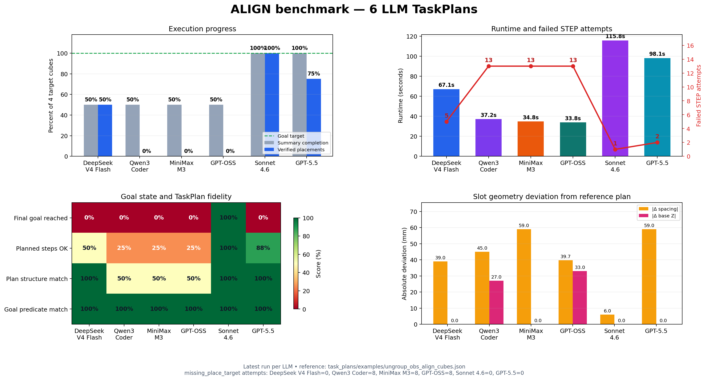
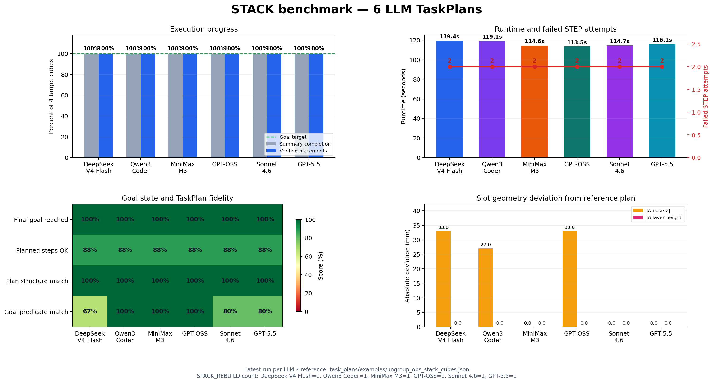

# CTAMP Robot Framework

Framework tabletop manipulation untuk Franka Panda dengan pipeline:

```text
CONTEXT.MD -> LLM satu kali -> TaskPlan JSON -> validasi -> binding geometrik
-> Pinocchio/MuJoCo IK -> OMPL -> MuJoCo execution -> observed verification
```

LLM tidak dipanggil saat simulasi berjalan dan tidak pernah menghasilkan joint
angle atau trajectory. TaskPlan wajib melewati validation gates sebelum backend
MuJoCo diimpor.

## Pipeline end-to-end


LLM hanya menentukan goal dan urutan simbolik. Target pose, grasp candidate,
IK, collision validity, trajectory OMPL, serta keputusan keberhasilan tetap
ditentukan oleh komponen deterministik dan verifier berbasis state MuJoCo.

### Recovery tower stack

Cube diambil dan ditempatkan satu per satu dari bawah ke atas. Setiap cube harus
teramati sudah berada di base atau di atas support yang benar sebelum runner
boleh mengambil cube berikutnya. Jika placement gagal atau cube jatuh, cube
tersebut diambil ulang dan level stack yang invalid langsung dibangun kembali.
Stable prefix dipertahankan. Recovery dibatasi tiga rebuild oleh
`recovery.max_stack_rebuilds`; setelah batas habis run langsung gagal. Obstacle
displacement tetap fatal.

`layer_height_m` pada plan adalah nilai nominal symbolic. Backend MuJoCo
mengikat target Z menggunakan vertical half-extent live dari support dan cube
yang dipegang. Karena itu cube yang berubah orientasi tidak dipaksa masuk ke
support berdasarkan tinggi nominal yang sudah stale.
Semua world memakai cube seragam `6.6 x 6.6 x 6.6 cm`, sehingga penampang grip
dan kontak antar-layer lebih besar tanpa melampaui bukaan gripper Panda.
Orientation dan velocity direkam sebagai diagnostic, tetapi belum menjadi hard
gate sampai primitive place mengontrol orientasi object secara eksplisit.

## Benchmark TaskPlan enam LLM

Visualisasi berikut membandingkan DeepSeek V4 Flash, Qwen3 Coder, MiniMax M3,
GPT-OSS, Sonnet 4.6, dan GPT-5.5 pada context `align` dan `stack`. Satu data
point adalah **run terbaru** untuk pasangan task dan model. Karena saat ini
hanya satu run terbaru per pasangan yang dipilih, hasil ini merupakan
perbandingan run, bukan estimasi statistik atau rata-rata keberhasilan model.

TaskPlan pembanding adalah
`task_plans/examples/ungroup_obs_align_cubes.json` dan
`task_plans/examples/ungroup_obs_stack_cubes.json`. Arti metrik pada kedua
gambar:

- **Summary completion**: nilai `completion_percent` yang ditulis summary CSV.
- **Verified placements**: persentase target unik dengan event `STEP=OK` untuk
  `place` atau `stack_place`; placement recovery tetap dihitung.
- **Final goal reached**: hasil verifier final yang direkam sebagai `success`.
- **Planned steps OK**: step ID asli TaskPlan yang pernah menghasilkan
  `STEP=OK`, dibagi jumlah step asli. Step recovery tambahan tidak masuk
  denominator.
- **Failed STEP attempts**: seluruh attempt berstatus `FAILED`, termasuk retry.
- **Plan structure match**: kecocokan per posisi untuk tuple `action`, `object`,
  `slot`, dan `on_top_of` terhadap TaskPlan pembanding.
- **Goal predicate match**: Jaccard similarity antara himpunan predicate plan
  kandidat dan plan pembanding. Predicate tambahan ikut menurunkan skor.
- **Slot geometry deviation**: selisih absolut field geometri terhadap plan
  pembanding dalam milimeter. Ini mengukur perbedaan plan, bukan otomatis
  kesalahan fisik, karena backend masih melakukan geometric binding dari state
  MuJoCo.
- **Runtime**: `duration_ms` summary yang dikonversi ke detik.

### Align



Cara membaca visualisasi `align`:

- **Execution progress** membandingkan `summary completion` dari CSV dengan
  `verified placements` dari event aktual. Panel ini dipakai untuk mengecek
  apakah angka ringkasan benar-benar berarti cube sudah masuk slot. Insight
  utama: Sonnet 4.6 konsisten 100% pada summary dan verified placement, GPT-5.5
  punya summary 100% tetapi hanya 75% placement terverifikasi, sedangkan Qwen3
  Coder, MiniMax M3, dan GPT-OSS menunjukkan summary 50% walaupun tidak ada
  placement valid.
- **Runtime and failed STEP attempts** membandingkan lama eksekusi dengan jumlah
  attempt step yang gagal. Panel ini tidak mencari model tercepat saja, tetapi
  membedakan run cepat karena berhasil efisien atau cepat karena gagal awal.
  Insight utama: Qwen3 Coder, MiniMax M3, dan GPT-OSS terlihat cepat karena
  banyak gagal `missing_place_target`; Sonnet 4.6 lebih lama karena benar-benar
  menyelesaikan seluruh sequence 4 cube.
- **Goal state and TaskPlan fidelity** membandingkan empat hal: final goal,
  step asli yang berhasil, kecocokan struktur action, dan kecocokan predicate
  terhadap reference plan. Panel ini memisahkan kualitas simbolik JSON dari
  hasil fisik simulasi. Insight utama: GPT-5.5 punya struktur dan predicate
  100%, tetapi final goal tetap gagal; artinya JSON secara simbolik benar belum
  cukup jika observed verifier tidak melihat goal akhir.
- **Slot geometry deviation** membandingkan jarak parameter geometri plan dari
  reference plan, khusus `align` pada `spacing_m` dan `base_z`. Panel ini
  menunjukkan seberapa berbeda posisi target yang diminta LLM. Insight utama:
  Sonnet 4.6 hanya berbeda 6 mm pada spacing dan tetap feasible, sedangkan
  variasi spacing yang lebih besar pada model lain berkorelasi dengan placement
  yang lebih rentan gagal atau tidak tervalidasi.

| Model | Summary | Placement terverifikasi | Final goal | Runtime | Failed attempt | Planned OK | Struktur plan |
|---|---:|---:|:---:|---:|---:|---:|---:|
| DeepSeek V4 Flash | 50% | 50% (2/4) | gagal | 67.119 s | 5 | 50% | 100% |
| Qwen3 Coder | 50% | 0% (0/4) | gagal | 37.162 s | 13 | 25% | 50% |
| MiniMax M3 | 50% | 0% (0/4) | gagal | 34.834 s | 13 | 25% | 50% |
| GPT-OSS | 50% | 0% (0/4) | gagal | 33.841 s | 13 | 25% | 50% |
| Sonnet 4.6 | 100% | 100% (4/4) | berhasil | 115.775 s | 1 | 100% | 100% |
| GPT-5.5 | 100% | 75% (3/4) | gagal | 98.116 s | 2 | 88% | 100% |

Sonnet 4.6 menjadi satu-satunya run `align` yang mencapai final goal 4/4.
Struktur TaskPlan dan predicate-nya cocok 100%, semua slot memakai format
`slot_0` sampai `slot_3`, dan spacing yang dipilih masih berada dalam jangkauan
robot. GPT-5.5 juga memiliki struktur plan 100%, tetapi final verifier tetap
gagal: satu `place` cube2 tidak menghasilkan expected effect yang teramati, lalu
run berakhir dengan `final_goal_not_observed`. Karena itu summary 100% pada
GPT-5.5 tidak sama dengan final goal berhasil.

DeepSeek memakai nama slot yang benar dan berhasil menempatkan dua cube, tetapi
berhenti sebelum final goal. Qwen3 Coder, MiniMax M3, dan GPT-OSS memakai
`slot0` sampai `slot3` pada steps; masing-masing menghasilkan delapan attempt
`missing_place_target` dan tidak memiliki placement valid. Runtime yang lebih
pendek pada tiga run tersebut bukan performa lebih baik, melainkan run gagal
lebih awal.

### Stack



Cara membaca visualisasi `stack`:

- **Execution progress** membandingkan summary dengan placement tower yang
  benar-benar terverifikasi. Untuk stack, panel ini menguji apakah semua cube
  berhasil ditempatkan sebagai tower, bukan hanya step selesai dieksekusi.
  Insight utama: keenam LLM konsisten 100% pada summary dan verified placement,
  sehingga semua run mencapai stack 4/4.
- **Runtime and failed STEP attempts** membandingkan durasi eksekusi dengan
  jumlah failed attempt. Untuk stack, runtime terutama dipengaruhi retry dan
  rebuild tower, bukan perbedaan jumlah step karena struktur plan keenam model
  hampir sama. Insight utama: semua model punya dua failed attempt dan satu
  rebuild; GPT-OSS paling cepat pada sampel ini, tetapi selisihnya kecil karena
  semua menjalani pola recovery yang sama.
- **Goal state and TaskPlan fidelity** membandingkan final goal, step asli OK,
  struktur action, dan predicate match. Panel ini menunjukkan apakah tower
  berhasil karena plan memang sesuai kontrak atau karena recovery menutup error
  eksekusi. Insight utama: final goal semua 100% dan struktur action semua
  100%; nilai `Planned steps OK` hanya 88% karena ada step asli yang gagal lalu
  digantikan oleh recovery/rebuild.
- **Slot geometry deviation** membandingkan `base_z` dan `layer_height_m`
  terhadap reference plan. Untuk stack, ini penting karena sedikit perbedaan Z
  dapat mempengaruhi stabilitas tower. Insight utama: MiniMax M3, Sonnet 4.6,
  dan GPT-5.5 memakai geometri yang sama dengan reference; DeepSeek, Qwen3
  Coder, dan GPT-OSS berbeda pada `base_z`, tetapi backend binding dan recovery
  masih membuat final tower berhasil.

| Model | Summary | Placement terverifikasi | Final goal | Runtime | Failed attempt | Rebuild | Predicate |
|---|---:|---:|:---:|---:|---:|---:|---:|
| DeepSeek V4 Flash | 100% | 100% (4/4) | berhasil | 119.417 s | 2 | 1 | 67% |
| Qwen3 Coder | 100% | 100% (4/4) | berhasil | 119.114 s | 2 | 1 | 100% |
| MiniMax M3 | 100% | 100% (4/4) | berhasil | 114.563 s | 2 | 1 | 100% |
| GPT-OSS | 100% | 100% (4/4) | berhasil | 113.451 s | 2 | 1 | 100% |
| Sonnet 4.6 | 100% | 100% (4/4) | berhasil | 114.666 s | 2 | 1 | 80% |
| GPT-5.5 | 100% | 100% (4/4) | berhasil | 116.101 s | 2 | 1 | 80% |

Semua run `stack` mencapai tower 4/4. Setiap run memiliki dua failed attempt dan
satu `STACK_REBUILD`; akibatnya hanya 7 dari 8 step ID asli yang pernah berstatus
OK (87.5%, dibulatkan 88% pada gambar), tetapi placement recovery membuat final
goal tetap 100%. GPT-OSS memiliki runtime terpendek pada sampel ini, sedangkan
Sonnet 4.6 dan GPT-5.5 tetap berada di kelompok berhasil dengan geometri base
dan layer yang sama dengan reference plan.

Seluruh plan `stack` cocok 100% pada struktur action. Perbedaan predicate bukan
kegagalan eksekusi: DeepSeek turun ke 67% karena menambahkan `clear(cube4)` dan
`handempty`, sedangkan Sonnet 4.6 dan GPT-5.5 turun ke 80% karena menambahkan
`clear(cube4)` di luar empat predicate referensi.

Gambar dapat dibuat ulang setelah log baru ditambahkan:

```bash
python -m pip install -e ".[viz]"
python -m telemetry.visualize_llm_benchmarks
```

## Quick start

```bash
python3 -m venv .venv
source .venv/bin/activate       # Windows: .venv\Scripts\activate
python -m pip install -e ".[test]"
cp .env.example .env           # Windows: copy .env.example .env
pytest -q
```

Package framework berada langsung di root repository. Editable install tetap
disarankan agar entrypoint tersedia dari directory mana pun. Python minimum
adalah 3.10.

Validasi tiga plan obstacle tanpa memanggil LLM:

```bash
python -m cli.generate_plan \
  --context contexts/examples/ungroup_obs_align_cubes.md \
  --task align \
  --response-file task_plans/examples/ungroup_obs_align_cubes.json \
  --output task_plans/generated

python -m cli.generate_plan \
  --context contexts/examples/ungroup_obs_stack_cubes.md \
  --task stack \
  --response-file task_plans/examples/ungroup_obs_stack_cubes.json \
  --output task_plans/generated

python -m cli.generate_plan \
  --context contexts/examples/ungroup_obs_pyramid_cubes.md \
  --task pyramid \
  --response-file task_plans/examples/ungroup_obs_pyramid_cubes.json \
  --output task_plans/generated
```

Ketiga file pada `task_plans/examples/` sudah merupakan TaskPlan siap eksekusi.
Jalankan align obstacle dengan viewer:

```bash
python -m cli.run_simulation \
  --plan task_plans/examples/ungroup_obs_align_cubes.json \
  --context contexts/examples/ungroup_obs_align_cubes.md \
  --scene ungroup_obs \
  --runtime-config configuration/profiles/runtime/obstacle.toml \
  --viewer
```

Jalankan stack obstacle dengan viewer:

```bash
python -m cli.run_simulation \
  --plan task_plans/examples/ungroup_obs_stack_cubes.json \
  --context contexts/examples/ungroup_obs_stack_cubes.md \
  --scene ungroup_obs \
  --runtime-config configuration/profiles/runtime/obstacle.toml \
  --viewer
```

Jalankan stacked pyramid obstacle tanpa viewer:

```bash
python -m cli.run_simulation \
  --plan task_plans/generated/ungroup_obs_pyramid_cubes_pyramid.json \
  --context contexts/examples/ungroup_obs_pyramid_cubes.md \
  --scene ungroup_obs \
  --runtime-config configuration/profiles/runtime/pyramid.toml \
  --no-viewer
```

Gunakan `pyramid.toml` untuk case stacked pyramid karena release height,
guided-open, dan settle count disimpan di profile tersebut. Jangan fine-tune
angka release langsung di plugin atau backend.

## Struktur utama

```text
MVP-CTAMP-ROBOT2/
|-- assets/                 # mesh visual/collision Panda; wajib runtime
|-- models/
|   |-- panda.xml           # base model source
|   `-- generated/          # scene XML runtime; ignored Git
|-- configuration/
|   |-- defaults.py         # built-in defaults dan profile registry
|   |-- loader.py           # validasi dan TOML overlay
|   |-- runtime.py          # resolved active configuration
|   |-- types.py            # immutable typed configuration schema
|   `-- profiles/
|       |-- models/         # override model dan reference pose
|       `-- runtime/        # profile fine-tuning TOML
|-- contexts/examples/      # context align, stack, dan pyramid obstacle siap pakai
|-- task_plans/examples/    # contoh artefak TaskPlan
|-- adaptive/               # hint dari event historis
|-- backends/mujoco/        # MuJoCo, Pinocchio, OMPL, collision, trace
|-- cli/                    # generate plan dan run simulation
|-- execution/              # generic runner, primitives, recovery, verifier
|-- task_planning/          # TaskPlan types, loader, generator, validator
|-- plugins/                # task plugins dan deterministic discovery
|-- scene/                  # scene variants dan XML generation
|-- telemetry/              # summary dan reproducible run manifest
|-- world/                  # Context parser, WorldState, slot allocation
`-- tests/                  # unit dan integration tests tanpa viewer
```

Environment hanya digunakan untuk credential dan endpoint provider LLM.
Parameter model, IK, OMPL, grasp, collision, verifier, adaptive hints, dan
telemetry berada pada typed code profile atau TOML.

## Dokumentasi

- [Arsitektur](docs/architecture.md)
- [Cara penggunaan](docs/usage.md)
- [Fungsi setiap file](docs/file-reference.md)
- [Menambah task, profile, dan model](docs/extending.md)

## Status validasi

```text
62 passed
```

Test suite memvalidasi contracts, plan gates, context parsing, slot allocation,
plugin discovery, runtime configuration, recovery, verifier, scene generation,
manifest, dan generic task runner. Pengujian motion native tetap membutuhkan
binding MuJoCo/OMPL sesuai platform.
