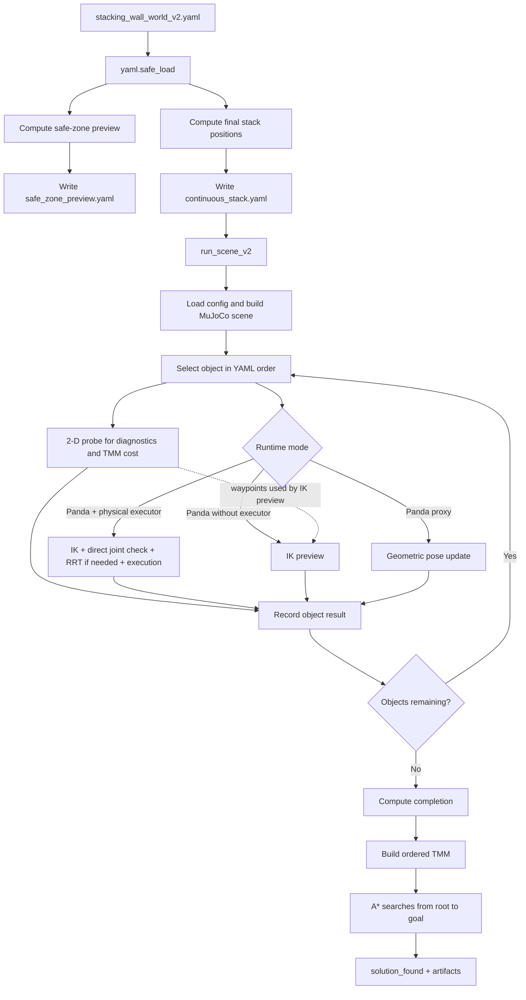
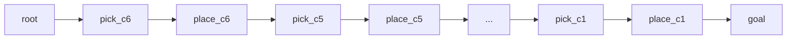

# CTAMP Robot

This repository runs a CTAMP pipeline for task planning, motion planning, 7-DOF Panda IK, and MuJoCo execution.

This README follows one concrete path. A user provides [`stacking_wall_world_v2.yaml`](configs/scenes/stacking_wall_world_v2.yaml), and the document traces that data until all six cubes have been attempted.

Sections 1-3 cover the YAML input, targets, and ordering. Sections 4-7 cover coordinate frames, planning, IK, execution, and success. Section 8 explains the TMM. Sections 9-10 cover outputs and tests.

## Three Things to Understand First

1. In the stacking scenario, the YAML fixes the order `c6 -> c5 -> ... -> c1`. The planner does not infer which cube is largest.
2. The 2-D motion probe and physical IK/execution are separate validation layers. Both are recorded, but physical mode uses physical execution to decide per-object success.
3. The TMM is built after the pick-place loop. It currently does not select the stacking order or send trajectories to the robot.

## Run the Stacking Scenario

Preview the targets without running MuJoCo:

```bash
python3 -m cli.run_stacking_v2 \
  --config configs/scenes/stacking_wall_world_v2.yaml \
  --output runs/stacking_preview \
  --dry-run
```

Run the full scenario:

```bash
python3 -m cli.run_stacking_v2 \
  --config configs/scenes/stacking_wall_world_v2.yaml \
  --output runs/stacking_v2
```

Add `--viewer` to open the MuJoCo viewer. Use `python` instead of `python3` if that is the interpreter name on your system.

After installation, the equivalent entry point is `ctamp-run-stacking-v2`.

## End-to-End Flow



The call chain is:

```text
cli/run_stacking_v2.py
  -> ctamp/experiments/run_stacking_v2.py
     -> ctamp/experiments/run_scene_v2.py
        -> ctamp/experiments/run_scene.py
```

`run_scene_v2` does not replace the v1 success logic. It wraps `run_scene` with `plan_xy` caching and MuJoCo batching. See [`run_scene_v2.run()`](ctamp/experiments/run_scene_v2.py#L93-L124).

## 1. YAML as the Scene Contract

The most important parts of the stacking YAML are:

```yaml
table:
  z_top: 0.80

objects:
  - {id: c1, size_xyz: [0.058, 0.058, 0.058], pose: [-0.0500, -0.5800, 0.829]}
  # ...
  - {id: c6, size_xyz: [0.098, 0.098, 0.098], pose: [0.1090, 0.3708, 0.849]}

task:
  target_objects: [c6, c5, c4, c3, c2, c1]
  preserve_order: true

physical_execution:
  completion_policy: strict
  minimum_completion_ratio: 1.0

stacking_v2:
  final_stack_xy: [-0.30, -0.75]
  final_order_bottom_to_top: [c6, c5, c4, c3, c2, c1]
```

The full source is [`configs/scenes/stacking_wall_world_v2.yaml`](configs/scenes/stacking_wall_world_v2.yaml#L1-L83).

Fields that affect the runtime flow:

| YAML field | Purpose |
|---|---|
| `objects[].pose` | Initial cube-center position in the MuJoCo world frame |
| `objects[].size_xyz` | Cube geometry and target stack height |
| `objects[].grip_target_width` | Requested gripper opening for that cube |
| `robot.base_xy/base_z` | Panda base position in the MuJoCo world |
| `robot.reach_min_xy/reach_max_xy` | Radial limits used by the 2-D MotionProbe |
| `robot.physical_start_qpos` | Initial configuration of the seven Panda joints |
| `task.target_objects` | Objects that must be attempted |
| `task.preserve_order` | Forces the runner to follow the configured order |
| `obstacles[].pose/size` | Obstacle geometry for the scene and route probe |
| `constraints.max_retries_per_object` | Maximum transfer-probe retries |
| `stacking_v2.final_stack_xy` | Shared X-Y target for every stack layer |
| `stacking_v2.final_order_bottom_to_top` | Bottom-to-top cube order |
| `physical_execution.completion_policy` | Final acceptance rule |

The initial load is intentionally simple:

```python
config = yaml.safe_load(config_path.read_text(encoding="utf-8"))
```

See [`run_stacking_v2.run()`](ctamp/experiments/run_stacking_v2.py#L182-L195).

The loader only converts readable YAML into Python data. Required fields are accessed later, so missing fields or unknown object names fail when the pipeline uses them.

## 2. From YAML to Safe-Zone Preview and Stack Targets

`build_phase_configs()` creates two derived configurations:

1. `safe_zone_preview.yaml`: a flat arrangement for preview and possible future fallback logic.
2. `continuous_stack.yaml`: the stack target passed to the MuJoCo runner.

See [`build_phase_configs()`](ctamp/experiments/run_stacking_v2.py#L119-L147).

The safe zone is currently preview-only. `run()` executes `continuous_stack.yaml`, not `safe_zone_preview.yaml`.

```python
stack_path = _write_preview_configs(output, safe_zone_config, stack_config)

continuous = run_scene_v2(
    stack_path,
    output / "continuous_stack",
    ...
)
```

See [`run_stacking_v2.run()`](ctamp/experiments/run_stacking_v2.py#L191-L213).

The name `safe_zone` therefore does not mean that the robot automatically moves a failed cube there.

### Safe-Zone Position Calculation

For the `x` axis, cube `i` receives:

```text
x_i = origin_x + i * spacing
y_i = origin_y
z_i = table_z + cube_height_i / 2
```

With `origin = [0.08, -0.50]` and `spacing = 0.095`, `c6` is placed at `x=0.08`, `c5` at `x=0.175`, and so on.

See [`_safe_zone_positions()`](ctamp/experiments/run_stacking_v2.py#L48-L66).

### Final Stack Position Calculation

All cubes share X-Y `[-0.30, -0.75]`. Each cube center is calculated from the available supporting surface:

```text
surface_z_0     = table.z_top
center_z_i      = surface_z_i + height_i / 2
surface_z_(i+1) = surface_z_i + height_i
```

See [`_stack_positions()`](ctamp/experiments/run_stacking_v2.py#L33-L45).

Targets generated by the default YAML:

| Order | Cube | Height | Center target `[x, y, z]` |
|---:|---|---:|---|
| 1/6, bottom | `c6` | `0.098` | `[-0.30, -0.75, 0.849]` |
| 2/6 | `c5` | `0.090` | `[-0.30, -0.75, 0.943]` |
| 3/6 | `c4` | `0.082` | `[-0.30, -0.75, 1.029]` |
| 4/6 | `c3` | `0.074` | `[-0.30, -0.75, 1.107]` |
| 5/6 | `c2` | `0.066` | `[-0.30, -0.75, 1.177]` |
| 6/6, top | `c1` | `0.058` | `[-0.30, -0.75, 1.239]` |

For example, the `c5` center height is:

```text
z_c5 = 0.80 + 0.098 + 0.090/2
     = 0.943
```

Nominally, there is no gap between the first two layers:

```text
top(c6)    = 0.849 + 0.098/2 = 0.898
bottom(c5) = 0.943 - 0.090/2 = 0.898
```

These positions are stored in `tidy_groups[].positions`. `generate_tidy_slots()` copies each position into an object-specific `GoalSlot`.

See [`generate_tidy_slots()`](ctamp/simulation/scene.py#L43-L64).

The data passed to `run_scene_v2` includes:

```yaml
task:
  target_objects: [c6, c5, c4, c3, c2, c1]
  preserve_order: true

tidy_groups:
  - id: continuous_stack
    objects: [c6, c5, c4, c3, c2, c1]
    positions:
      c6: [-0.30, -0.75, 0.849]
      c5: [-0.30, -0.75, 0.943]
      # ... through c1
```

`_phase_config()` writes this derived configuration to `continuous_stack.yaml`. See [`run_stacking_v2.py`](ctamp/experiments/run_stacking_v2.py#L89-L116).

## 3. Object Ordering

### Stacking Uses the YAML Order

`final_order_bottom_to_top` becomes `task.target_objects`. With `preserve_order: true`, the selector always takes the first remaining object.

```python
def _next_object(pending: list[str]) -> str:
    if preserve_order:
        return pending[0]
```

See [`_next_object()`](ctamp/experiments/run_scene.py#L376-L425).

The order is:

```text
c6 largest -> c5 -> c4 -> c3 -> c2 -> c1 smallest
```

This is a **required stacking order**, not a priority discovered by the planner. The code does not sort `size_xyz`; an incorrect YAML order is still followed.

### When `preserve_order` Is Disabled

Other scenes use this score:

```text
score = transit_length + transfer_length
      + 5000 if transit fails
      + 3000 if transfer fails
      + 200 if transit is not direct
      + 200 if transfer is not direct
      + 0.01 * original_order
```

The object with the lowest score is selected. With an active Panda model, the runner also probes at most four leading candidates for a feasible grasp.

See the scoring and IK precheck in [`run_scene.py`](ctamp/experiments/run_scene.py#L383-L425).

This scoring path is inactive for the stacking YAML because `preserve_order` is `true`.

## 4. Scene Construction and Coordinate Frames

This repository does not use ROS `tf` or `tf2`. Scene poses are expressed directly in one MuJoCo world frame.

```text
robot.base_xy + robot.base_z -> link0 body position in world
objects[].pose               -> cube_<id> body position in world
obstacles[].pose             -> obstacle geom position in world
GoalSlot.position            -> target site position in world
```

See Panda placement in [`MuJoCoSceneBuilder.build_xml()`](ctamp/simulation/mujoco_scene_builder.py#L28-L62).

See obstacle, cube, and slot placement in [`mujoco_scene_builder.py`](ctamp/simulation/mujoco_scene_builder.py#L84-L164).

After the XML is loaded, `mj_forward()` computes every body and site pose. `get_body_pose()` reads `data.xpos` and `data.xquat` from MuJoCo.

See [`MuJoCoBackend.load_model()`](ctamp/simulation/mujoco_backend.py#L24-L38) and [`get_body_pose()`](ctamp/simulation/mujoco_backend.py#L49-L52).

### Relative Transform Used During Carry

A relative transform is calculated when a grasped cube must follow the hand:

```text
p_cube_in_hand = R_hand^T * (p_cube_world - p_hand_world)
R_cube_in_hand = R_hand^T * R_cube_world
```

The runtime stores this transform in the `carry_<object_id>` equality weld after bilateral finger contact has been validated.

See [`PandaPhysicsExecutor.set_carry_constraint()`](ctamp/simulation/panda_physics.py#L120-L147).

The actual flow is not `YAML -> ROS TF -> IK`. It is `world pose from YAML -> MuJoCo world target -> IK`.

## 5. Geometric Motion Planning Before IK

For each object, the runner issues two queries:

```text
transit : current_xy -> object.pose[:2]
transfer: object.pose[:2] -> GoalSlot.position[:2]
```

See [`run_scene.py`](ctamp/experiments/run_scene.py#L427-L457).

After a successful object, the 2-D planner's `current_xy` becomes the slot X-Y. This is an abstract probe state, not the physical end-effector pose. The physical arm returns to a safe or home pose.

See [`run_scene.py`](ctamp/experiments/run_scene.py#L306-L310) and [`run_scene.py`](ctamp/experiments/run_scene.py#L514-L520).

`MuJoCoMotionPlanner.plan_xy()` converts the probe result into a `MotionPlan` with status, waypoints, length, clearance, route type, and planning time.

See [`MuJoCoMotionPlanner.plan_xy()`](ctamp/motion_planning/mujoco.py#L16-L38).

### Obstacle Inflation

The wall is treated as a 2-D rectangle inflated by clearance `c = 0.055 m`:

```text
x_min = x - size_x/2 - c
x_max = x + size_x/2 + c
y_min = y - size_y/2 - c
y_max = y + size_y/2 + c
```

See [`MotionProbe._inflated_rect()`](ctamp/simulation/scene.py#L128-L138).

For the YAML wall at `[0.00, -0.08]` with size `[0.08, 0.10]`, the inflated rectangle is:

```text
x = [-0.095, 0.095]
y = [-0.185, 0.025]
```

### Route Selection

1. Try a direct line.
2. If blocked, generate candidates on both sides of the wall.
3. Reject candidates outside the table, outside reach, or intersecting the rectangle.
4. Select the shortest valid polyline.

Route length is the sum of Euclidean segment lengths:

```text
L = distance(p0, p1) + distance(p1, p2) + ...
```

See [`MotionProbe.probe()`](ctamp/simulation/scene.py#L159-L205).

### Worked Example: Transit to `c6`

Home X-Y is derived from the base, minimum reach, and a `0.02` offset:

```text
home_xy = [-0.42 + 0.25 + 0.02, -0.08]
        = [-0.15, -0.08]
```

The YAML target for `c6` is `[0.109, 0.3708]`. The direct line intersects the wall, so `left_corridor` becomes:

```text
[-0.15, -0.08]
-> [-0.15,  0.035]
-> [ 0.109, 0.035]
-> [ 0.109, 0.3708]
```

Its length is:

```text
L = 0.115 + 0.259 + 0.3358
  = 0.7098 m
```

The value `0.035` is the rectangle's upper side at `0.025` plus a `0.01` corridor margin.

See home X-Y in [`run_scene.py`](ctamp/experiments/run_scene.py#L84-L90). See the corridor calculation in [`scene.py`](ctamp/simulation/scene.py#L165-L197).

If transfer fails, `probe_transfer()` repeats the query up to `max_retries_per_object`. The geometric query is deterministic, so retries currently do not generate new candidates.

See [`probe_transfer()`](ctamp/experiments/scene_helpers.py#L54-L69).

## 6. From World Targets to IK and Joint Trajectories

The 2-D motion probe and Panda IK are different calculations.

In physical stacking, the 2-D probe supplies route diagnostics. The physical executor uses the cube's current MuJoCo pose and the goal slot to build grasp, lift, and place joint paths.

See [`_execute_physical_pick_place()`](ctamp/experiments/run_scene.py#L170-L310).

The physical path does not convert the X-Y `MotionPlan` waypoints into a joint trajectory. The geometric probe and physical IK/RRT results must therefore be treated as separate evidence.

In IK-preview mode without a physical executor, X-Y waypoints are densified and assigned a fixed Z before being passed to `solve_path()`.

```python
transit_targets = _dense_xyz(transit.waypoints, 0.95)[1:]
transfer_targets = _dense_xyz(motion.waypoints, 0.938)[1:]
```

See [`_execute_ik_preview()`](ctamp/experiments/run_scene.py#L312-L374).

### IK Calculation

The target and gripper are both expressed in the world frame. Position error is:

```text
e_pos = p_target_world - p_gripper_world
```

When orientation is supplied, rotation error is:

```text
e_rot = 0.5 * sum(cross(R_current[:, i], R_target[:, i]))
```

The combined error and Jacobian use orientation weight `0.35`:

```text
error = [e_pos; 0.35 * e_rot]
J     = [J_pos; 0.35 * J_rot]
```

The solver uses damped least squares:

```text
delta_q = J^T * inverse(J * J^T + damping * I) * error
q_next  = clip(q_current + step_size * delta_q, q_min, q_max)
```

Important defaults:

```text
tolerance      = 0.002 m
damping        = 0.002
step_size      = 0.6
max_iterations = 250
```

The `0.002 m` value is the position tolerance. With an orientation target, termination also requires `norm(e_rot) <= orientation_tolerance`.

The default orientation tolerance is `0.035 rad`. Call sites override it: lift uses `0.10`, physical pregrasp candidates use `0.35`, and the final grasp uses `0.08`.

See [`PandaIKSolver.solve()`](ctamp/simulation/panda_ik.py#L103-L175).

See per-stage tolerances in [`run_scene.py`](ctamp/experiments/run_scene.py#L198-L229) and [`plan_physical_grasp()`](ctamp/simulation/panda_ik.py#L422-L491).

If a seed fails or collides, the solver tries other seeds. A result is accepted only when the residual is small enough and the robot is collision-free.

See [`solve_collision_free()`](ctamp/simulation/panda_ik.py#L177-L224).

### Grasp, Lift, and Place

For a physical grasp, the solver tries `top`, `side_pos_x`, `side_neg_x`, `side_pos_y`, and `side_neg_y` approaches.

See [`plan_physical_grasp()`](ctamp/simulation/panda_ik.py#L422-L495).

After a grasp is found:

```text
lift_target     = gripper_position + [0, 0, 0.14]
place_target    = slot.position + [0, 0, 0.06]
preplace_target = place_target + [0, 0, 0.14]
```

See [`run_scene.py`](ctamp/experiments/run_scene.py#L198-L229).

For `c6` with a top grasp:

```text
cube_world     = [0.109, 0.3708, 0.849]
grasp_target   = cube_world + [0, 0, 0.02]
               = [0.109, 0.3708, 0.869]
pregrasp       = grasp_target - [0, 0, -1] * 0.14
               = [0.109, 0.3708, 1.009]
```

For the bottom `c6` slot:

```text
slot           = [-0.30, -0.75, 0.849]
place_target   = slot + [0, 0, 0.06]
               = [-0.30, -0.75, 0.909]
preplace       = place_target + [0, 0, 0.14]
               = [-0.30, -0.75, 1.049]
```

See the grasp-target and pregrasp calculations in [`plan_physical_grasp()`](ctamp/simulation/panda_ik.py#L422-L491).

Each Cartesian target becomes a joint candidate. If the direct joint-space segment collides, `plan_joint_rrt()` runs bidirectional RRT-Connect.

See [`solve_path()`](ctamp/simulation/panda_ik.py#L603-L679) and [`plan_joint_rrt()`](ctamp/simulation/panda_ik.py#L681-L759).

IK/RRT planning uses a MuJoCo backend separate from physical execution. Search-time `qpos` changes therefore do not move the live arm.

See backend separation in [`run_scene.py`](ctamp/experiments/run_scene.py#L111-L130).

### Physical Execution

Joint waypoints are sent to actuators with smoothstep interpolation. The number of subtargets is based on the ratio of maximum joint delta to `max_joint_step`.

Because interpolation uses smoothstep, `max_joint_step` controls the subtarget count but is not a strict upper bound on every commanded delta.

See [`follow_joint_path()`](ctamp/simulation/panda_physics.py#L85-L104).

Software accepts acquisition when:

1. The left finger touches the cube.
2. The right finger touches the cube.
3. The arm follows the lift path.
4. The cube rises by at least `0.04 m`.

See [`validate_grasp_and_lift()`](ctamp/simulation/panda_physics.py#L203-L243).

After bilateral contact, the runtime activates an equality weld before lifting. This is **contact-gated kinematic carry**, not an independent proof of force closure.

The YAML also sets `require_force_closure: false`. That field is not currently enforced as a runtime gate.

`close_gripper()` sends half of the total opening to the single-finger actuator. For `c6`, `grip_target_width=0.078` produces an actuator target of `0.039 m`.

See [`close_gripper()`](ctamp/simulation/panda_physics.py#L106-L118).

At the target, the weld is released, the gripper opens, the simulation settles, and the final cube pose is read from MuJoCo.

See placement release and measurement in [`run_scene.py`](ctamp/experiments/run_scene.py#L268-L296).

## 7. Success Criteria

### Per-Object Success

There are three per-object gates:

1. Panda + physical executor: success follows IK and physical execution.
2. Panda without a physical executor: 2-D transit, 2-D transfer, and IK preview must all succeed.
3. Panda proxy without IK: 2-D transit and transfer must succeed; the default IK value adds no physical validation.

```python
object_success = (
    execution.ik_success
    if physics_executor is not None
    else transit.success and motion.success and execution.ik_success
)
```

See [`run_scene.py`](ctamp/experiments/run_scene.py#L477-L498).

Physical execution may succeed even when the 2-D probe records `route_type: failed`. This is not a contradiction because physical IK/RRT is the primary validator in that mode.

### Whole-Stack Success

The YAML uses:

```yaml
completion_policy: strict
minimum_completion_ratio: 1.0
```

Under `strict`, all six `per_object_result[].success` values must be `true`.

See [`completion_status()`](ctamp/experiments/scene_helpers.py#L72-L92).

The final gate is:

```text
solution_found = accepted_completion AND tmm_search_success
```

See [`run_scene.py`](ctamp/experiments/run_scene.py#L521-L543).

The current software acceptance checklist is:

```text
completed_objects == 6
all_objects_solved == true
completion_ratio == 1.0
completion_policy == "strict"
failed_objects == []
continuous_stack.solution_found == true
metrics.json solution_found == true
```

### Limits of “Perfect Stacking”

`physical_tidy_success` currently checks only whether X-Y error is at most `0.07 m`:

```text
norm(placement_error_xy) <= 0.07
```

See [`run_scene.py`](ctamp/experiments/run_scene.py#L286-L296).

There is no explicit gate for Z error, cube tilt, inter-layer contact, center of mass, or tower stability after all cubes have been placed.

`solution_found=true` therefore means that the current software rules accepted the challenge. It is not formal proof of a perfectly stable tower.

The YAML `challenge.*` fields are also metadata. Obstacle behavior comes from `obstacles`, MotionProbe, IK/RRT collision checks, and physics. `side_corridors_required` is not enforced as a separate gate.

## 8. Task-Motion Multigraph

TMM means **Task-Motion Multigraph**. A vertex holds robot and workspace state. An edge holds an action, joint space, motion plan, and cost.

It is a multigraph because two vertices can have multiple parallel edges, such as alternative joint spaces for the same symbolic action.

See [`TaskMotionMultigraph`](ctamp/tmm/multigraph.py#L12-L37) and the [`Vertex`/`Edge`](ctamp/domain/models.py#L67-L82) models.

In the active ordered TMM, every vertex still shares placeholder `RobotState` and `WorkspaceState` objects. `root`, `pick`, `place`, and `goal` are milestones, not distinct state snapshots.

Fields such as `holding_object_id` and workspace poses are not updated between vertices by the active builder.

See [`build_ordered_tmm()`](ctamp/experiments/scene_helpers.py#L155-L180).

### When the TMM Is Built

The active stacking runtime follows this order:

```text
YAML fixes order
-> motion probe
-> IK/RRT
-> physical execution
-> collect all object results
-> build_ordered_tmm
-> TMMAStar.search
```

The object loop finishes before the TMM is built in [`run_scene.py`](ctamp/experiments/run_scene.py#L427-L530).

The current TMM does not select `c6` first, generate the stack target, or move the Panda.

### Ordered TMM Construction

Each object creates two vertices:

```text
pick_<object_id>
place_<object_id>
```

The six-cube graph is:



Each connection has two parallel edges:

```text
left_arm
left_arm_redundant
```

Both currently contain the same seven Panda joints. The `redundant` name does not yet represent a different joint-space dimension.

The builder also attaches the same `motion` object to transit and transfer edges. The `motions` dictionary contains transfer results; the actual transit plan is not passed to the builder.

Transit cost is zero, so this does not change the A* cost. However, a TMM transit edge should not be interpreted as containing the actual physical transit motion.

Assigned costs are:

```text
transit cost  = 0
transfer cost = motion.length if motion succeeds
transfer cost = 1_000_000 if motion fails
done cost     = 0
```

See [`build_ordered_tmm()`](ctamp/experiments/scene_helpers.py#L155-L232).

For `n` objects:

```text
vertex count = 2n + 2
edge count   = 4n + 2
```

Six cubes produce `14` vertices and `26` edges.

### A* Search

A* stores candidates in a priority queue:

```text
g_child = g_parent + edge.cost
f_child = g_child + heuristic(child)
```

The node with the smallest `f` is expanded first. Search succeeds when it reaches a `goal` vertex.

See [`TMMAStar.search()`](ctamp/search/tmm_astar.py#L122-L203).

The default heuristic is zero. In this runtime, A* is effectively uniform-cost search over one ordered branch.

See [`TMMAStar.__init__()`](ctamp/search/tmm_astar.py#L107-L120).

`TMMAStar()` also uses `MockVisitor` by default. The active search does not call the motion planner or IK; it reads existing edges and costs.

A failed edge remains in the graph with cost `1_000_000`, so A* can still reach the goal. In non-physical mode, completion rejects the failed motion because the object also fails.

In physical mode, an object may pass through physical execution even when the 2-D probe fails. A high-cost TMM edge therefore does not automatically make `solution_found` false.

### TMM Outputs

The TMM exists in memory and is not serialized as a graph. The runtime writes only:

```text
tmm_vertices
tmm_edges
expanded_vertices
```

`final_plan.json` comes from `plan_actions` collected during the object loop, not from `search_result.path_edges`.

`metrics.total_cost` is also not `search_result.cost`. It sums transit and transfer lengths for successful objects; the TMM search cost is not serialized.

See action collection in [`run_scene.py`](ctamp/experiments/run_scene.py#L477-L513) and output writing in [`run_scene.py`](ctamp/experiments/run_scene.py#L569-L592).

### Generic TMM vs. Active Stacking TMM

The repository also includes generic `SymbolicTaskPlanner` and `TMMGraphBuilder` modules for expanding task and joint-space alternatives.

The stacking runner uses the specialized `build_ordered_tmm()`. The generic modules should not be interpreted as selecting the order in active stacking runs.

See [`ctamp/planning/symbolic.py`](ctamp/planning/symbolic.py) and [`ctamp/tmm/builder.py`](ctamp/tmm/builder.py).

## 9. Outputs and Result Verification

A stacking run writes:

```text
runs/stacking_v2/
|-- safe_zone_preview.yaml
|-- continuous_stack.yaml
|-- stacking_plan.json
|-- metrics.json
`-- continuous_stack/
    |-- final_plan.json
    |-- metrics.json
    |-- challenge_ablation.json
    |-- scene_summary.json
    `-- OBSERVATION.md
```

See wrapper outputs in [`run_stacking_v2.py`](ctamp/experiments/run_stacking_v2.py#L150-L213).

See scene-runner outputs in [`run_scene.py`](ctamp/experiments/run_scene.py#L569-L617).

Recommended verification order:

1. Open `stacking_plan.json` and confirm the order and Z targets.
2. Open `continuous_stack/metrics.json` for per-object diagnostics.
3. Check `physical_grip_success`, `physical_lift_height`, `physical_tidy_success`, and `placement_error`.
4. Confirm that `failed_objects` is empty and strict completion is `1.0`.
5. Check `solution_found` in the outer `metrics.json`.

`challenge_ablation.json` describes direct and corridor routes in the 2-D probe. It is not evidence of physical tower stability.

## 10. Automated Evidence

`test_stacking_v2_builds_placeholder_then_large_to_small_stack` verifies:

- the `c6 -> ... -> c1` order;
- active `preserve_order`;
- `c6` is larger than `c1`;
- the `c6` target is below the `c1` target;
- all six slots are generated.

See [`tests/test_migrated_pipeline.py`](tests/test_migrated_pipeline.py#L43-L70).

The golden dry-run verifies the order and the generated safe-zone and final position for `c6`.

See [`tests/test_golden_regression.py`](tests/test_golden_regression.py#L42-L60).

Run the relevant tests with:

```bash
python3 -m pytest -q tests/test_migrated_pipeline.py
python3 -m pytest -q \
  tests/test_golden_regression.py::test_stacking_dry_run_golden \
  -m simulation
```

The current automated tests verify ordering and target generation. They are not full regression tests for the physical stability of a six-cube tower.

## Other Entry Points

Grouped tidy from YAML:

```bash
python3 -m cli.run_simulation \
  --config configs/scenes/align_grouped_tidy_wall_world.yaml \
  --output runs/example_yaml
```

Grouped tidy from a Markdown context:

```bash
python3 -m cli.run_simulation \
  --context contexts/examples/align_grouped_tidy_wall_world.md \
  --output runs/example_context
```

Performance-oriented v2 path:

```bash
python3 -m cli.run_simulation_v2 \
  --config configs/scenes/align_grouped_tidy_wall_world.yaml \
  --output runs/example_v2
```

If `--output` is omitted, the CLI writes artifacts to a timestamped directory under `runs/`.

The legacy TaskPlan/OMPL/adaptive-cache runner has been removed. The active runtime uses the `ctamp.*` modules described above.
