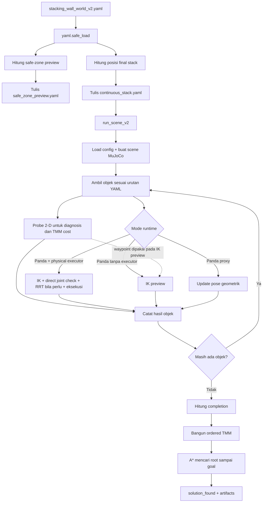
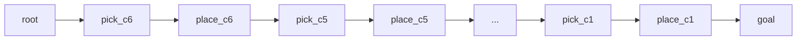

# CTAMP Robot

Repository ini menjalankan pipeline CTAMP untuk perencanaan task, perencanaan gerak, IK Panda 7-DOF, dan eksekusi MuJoCo.

README ini memakai sudut pandang paling konkret: pengguna memberikan [`stacking_wall_world_v2.yaml`](configs/scenes/stacking_wall_world_v2.yaml), lalu mengikuti datanya sampai enam kubus dicoba untuk ditumpuk.

Jalur baca cepat: bagian 1-3 menjelaskan YAML, target, dan urutan. Bagian 4-7 menjelaskan frame, planning, IK, dan sukses. Bagian 8 khusus TMM. Bagian 9-10 menunjukkan output dan bukti tes.

## Tiga hal yang perlu dipahami lebih dahulu

1. Pada skenario stacking, YAML menentukan urutan `c6 -> c5 -> ... -> c1`. Planner tidak menebak sendiri kubus mana yang paling besar.
2. Motion probe 2-D dan IK/eksekusi fisik adalah dua lapisan berbeda. Hasil keduanya dicatat, tetapi physical mode memakai keberhasilan fisik sebagai keputusan per objek.
3. TMM dibuat setelah loop pick-place selesai. TMM saat ini tidak memilih urutan stacking dan tidak mengirim trajectory ke robot.

## Menjalankan stacking

Preview target tanpa menjalankan MuJoCo:

```bash
python3 -m cli.run_stacking_v2 \
  --config configs/scenes/stacking_wall_world_v2.yaml \
  --output runs/stacking_preview \
  --dry-run
```

Eksekusi penuh:

```bash
python3 -m cli.run_stacking_v2 \
  --config configs/scenes/stacking_wall_world_v2.yaml \
  --output runs/stacking_v2
```

Tambahkan `--viewer` untuk membuka viewer MuJoCo. Gunakan `python` sebagai pengganti `python3` jika nama interpreter di sistem Anda adalah `python`.

Entry point setelah package dipasang adalah `ctamp-run-stacking-v2`.

## Peta alur end-to-end



Urutan file pemanggilnya adalah:

```text
cli/run_stacking_v2.py
  -> ctamp/experiments/run_stacking_v2.py
     -> ctamp/experiments/run_scene_v2.py
        -> ctamp/experiments/run_scene.py
```

`run_scene_v2` tidak mengganti logika keberhasilan v1. Ia membungkus `run_scene` dengan cache `plan_xy` dan batching MuJoCo. Buktinya ada di [`run_scene_v2.run()`](ctamp/experiments/run_scene_v2.py#L93-L124).

## 1. YAML dibaca sebagai kontrak scene

Bagian terpenting dari YAML stacking adalah:

```yaml
table:
  z_top: 0.80

objects:
  - {id: c1, size_xyz: [0.058, 0.058, 0.058], pose: [-0.0500, -0.5800, 0.829]}
  # ...
  - {id: c6, size_xyz: [0.098, 0.098, 0.098], pose: [0.1090, 0.3708, 0.849]}

task:
  target_objects: [c6, c5, c4, c3, c2, c1]
  preserve_order: true

physical_execution:
  completion_policy: strict
  minimum_completion_ratio: 1.0

stacking_v2:
  final_stack_xy: [-0.30, -0.75]
  final_order_bottom_to_top: [c6, c5, c4, c3, c2, c1]
```

Sumber lengkapnya ada di [`configs/scenes/stacking_wall_world_v2.yaml`](configs/scenes/stacking_wall_world_v2.yaml#L1-L83).

Arti field yang benar-benar memengaruhi alur:

| Field YAML | Dipakai untuk |
|---|---|
| `objects[].pose` | Posisi awal pusat kubus pada frame dunia MuJoCo |
| `objects[].size_xyz` | Ukuran kubus, target tinggi stack, dan geometri MuJoCo |
| `objects[].grip_target_width` | Bukaan gripper untuk kubus tersebut |
| `robot.base_xy/base_z` | Posisi base Panda pada dunia MuJoCo |
| `robot.reach_min_xy/reach_max_xy` | Batas radial pada MotionProbe 2-D |
| `robot.physical_start_qpos` | Konfigurasi awal tujuh joint Panda |
| `task.target_objects` | Daftar objek yang harus dicoba |
| `task.preserve_order` | Memaksa runner mengambil objek sesuai urutan |
| `obstacles[].pose/size` | Footprint obstacle untuk scene dan route probe |
| `constraints.max_retries_per_object` | Batas pengulangan probe transfer |
| `stacking_v2.final_stack_xy` | Titik X-Y bersama untuk semua lapisan stack |
| `stacking_v2.final_order_bottom_to_top` | Urutan dasar sampai puncak |
| `physical_execution.completion_policy` | Aturan penerimaan hasil akhir |

Pembacaan awalnya sederhana:

```python
config = yaml.safe_load(config_path.read_text(encoding="utf-8"))
```

Bukti: [`run_stacking_v2.run()`](ctamp/experiments/run_stacking_v2.py#L182-L195).

Loader ini hanya memastikan YAML dapat dibaca menjadi data Python. Field wajib diakses pada tahap berikutnya, sehingga field hilang atau nama objek salah akan gagal saat dipakai.

## 2. YAML diubah menjadi preview safe-zone dan target stack

`build_phase_configs()` membuat dua config turunan:

1. `safe_zone_preview.yaml`: susunan datar untuk preview atau rencana fallback di masa depan.
2. `continuous_stack.yaml`: target stack yang benar-benar diberikan ke runner MuJoCo.

Bukti pembentukan kedua config ada di [`build_phase_configs()`](ctamp/experiments/run_stacking_v2.py#L119-L147).

Hal penting: safe-zone saat ini hanya ditulis sebagai preview. `run()` mengeksekusi `continuous_stack.yaml`, bukan `safe_zone_preview.yaml`.

```python
stack_path = _write_preview_configs(output, safe_zone_config, stack_config)

continuous = run_scene_v2(
    stack_path,
    output / "continuous_stack",
    ...
)
```

Bukti: [`run_stacking_v2.run()`](ctamp/experiments/run_stacking_v2.py#L191-L213).

Jadi nama `safe_zone` belum berarti robot otomatis memindahkan kubus ke sana ketika stacking gagal.

### Cara menghitung posisi safe-zone

Untuk axis `x`, kubus ke-`i` mendapat:

```text
x_i = origin_x + i * spacing
y_i = origin_y
z_i = table_z + tinggi_kubus_i / 2
```

Dengan `origin = [0.08, -0.50]` dan `spacing = 0.095`, `c6` berada di `x=0.08`, `c5` di `x=0.175`, dan seterusnya.

Bukti rumus ada di [`_safe_zone_positions()`](ctamp/experiments/run_stacking_v2.py#L48-L66).

### Cara menghitung posisi final stack

Semua kubus memakai X-Y `[-0.30, -0.75]`. Tinggi pusat kubus dihitung dari permukaan yang tersedia:

```text
z_lantai_0 = table.z_top
z_pusat_i  = z_lantai_i + tinggi_i / 2
z_lantai_(i+1) = z_lantai_i + tinggi_i
```

Bukti rumus ada di [`_stack_positions()`](ctamp/experiments/run_stacking_v2.py#L33-L45).

Hasil untuk YAML bawaan:

| Urutan | Kubus | Tinggi | Target pusat `[x, y, z]` |
|---:|---|---:|---|
| 1/6, dasar | `c6` | `0.098` | `[-0.30, -0.75, 0.849]` |
| 2/6 | `c5` | `0.090` | `[-0.30, -0.75, 0.943]` |
| 3/6 | `c4` | `0.082` | `[-0.30, -0.75, 1.029]` |
| 4/6 | `c3` | `0.074` | `[-0.30, -0.75, 1.107]` |
| 5/6 | `c2` | `0.066` | `[-0.30, -0.75, 1.177]` |
| 6/6, puncak | `c1` | `0.058` | `[-0.30, -0.75, 1.239]` |

Contoh untuk `c5`:

```text
z_c5 = 0.80 + 0.098 + 0.090/2
     = 0.943
```

Secara nominal tidak ada gap antara dua lapisan pertama:

```text
top(c6)    = 0.849 + 0.098/2 = 0.898
bottom(c5) = 0.943 - 0.090/2 = 0.898
```

Posisi ini dimasukkan sebagai `tidy_groups[].positions`. `generate_tidy_slots()` lalu menyalinnya menjadi `GoalSlot` per objek.

Bukti penyalinan posisi eksplisit ada di [`generate_tidy_slots()`](ctamp/simulation/scene.py#L43-L64).

Bentuk data yang benar-benar masuk ke `run_scene_v2` antara lain:

```yaml
task:
  target_objects: [c6, c5, c4, c3, c2, c1]
  preserve_order: true

tidy_groups:
  - id: continuous_stack
    objects: [c6, c5, c4, c3, c2, c1]
    positions:
      c6: [-0.30, -0.75, 0.849]
      c5: [-0.30, -0.75, 0.943]
      # ... sampai c1
```

Config ini ditulis sebagai `continuous_stack.yaml` oleh [`_phase_config()`](ctamp/experiments/run_stacking_v2.py#L89-L116).

## 3. Bagaimana robot menentukan prioritas objek

### Pada stacking: urutan wajib dari YAML

`final_order_bottom_to_top` disalin menjadi `task.target_objects`. Karena `preserve_order: true`, pemilih objek selalu mengambil elemen pertama yang belum dikerjakan.

```python
def _next_object(pending: list[str]) -> str:
    if preserve_order:
        return pending[0]
```

Bukti: [`_next_object()`](ctamp/experiments/run_scene.py#L376-L425).

Urutannya adalah:

```text
c6 terbesar -> c5 -> c4 -> c3 -> c2 -> c1 terkecil
```

Ini lebih tepat disebut **urutan wajib stacking**, bukan prioritas yang ditemukan planner. Kode tidak menyortir `size_xyz`; jika urutan YAML salah, runner tetap mengikuti urutan itu.

### Jika `preserve_order` dimatikan

Untuk scene lain, runner menghitung skor:

```text
score = panjang_transit + panjang_transfer
      + 5000 jika transit gagal
      + 3000 jika transfer gagal
      + 200 jika transit bukan direct
      + 200 jika transfer bukan direct
      + 0.01 * urutan_awal
```

Objek dengan skor terkecil dipilih. Dengan Panda aktif, maksimal empat kandidat teratas juga dicoba untuk mencari grasp yang feasible.

Bukti scoring dan precheck IK ada di [`run_scene.py`](ctamp/experiments/run_scene.py#L383-L425).

Mekanisme scoring ini tidak aktif pada YAML stacking karena `preserve_order` bernilai `true`.

## 4. Dari YAML ke scene dan frame koordinat

Repo ini tidak memakai ROS `tf` atau `tf2`. Semua pose scene dinyatakan langsung pada satu frame dunia MuJoCo.

Pemetaan datanya:

```text
robot.base_xy + robot.base_z -> posisi body link0 pada world
objects[].pose               -> posisi body cube_<id> pada world
obstacles[].pose             -> posisi geom obstacle pada world
GoalSlot.position            -> posisi site target pada world
```

Bukti penempatan Panda ada di [`MuJoCoSceneBuilder.build_xml()`](ctamp/simulation/mujoco_scene_builder.py#L28-L62).

Bukti penempatan obstacle, kubus, dan slot ada di [`mujoco_scene_builder.py`](ctamp/simulation/mujoco_scene_builder.py#L84-L164).

Setelah XML dimuat, `mj_forward()` menghitung pose seluruh body dan site. `get_body_pose()` membaca `data.xpos` dan `data.xquat` dari MuJoCo.

Bukti: [`MuJoCoBackend.load_model()`](ctamp/simulation/mujoco_backend.py#L24-L38) dan [`get_body_pose()`](ctamp/simulation/mujoco_backend.py#L49-L52).

### Transform relatif yang benar-benar ada

Transform relatif dihitung ketika kubus perlu mengikuti tangan setelah grasp. Posisi dan rotasi kubus di frame tangan dihitung sebagai:

```text
p_cube_di_tangan = R_tangan^T * (p_cube_world - p_tangan_world)
R_cube_di_tangan = R_tangan^T * R_cube_world
```

Nilai ini dipakai untuk equality weld `carry_<object_id>` setelah kontak kedua jari tervalidasi.

Bukti: [`PandaPhysicsExecutor.set_carry_constraint()`](ctamp/simulation/panda_physics.py#L120-L147).

Jadi alurnya bukan `YAML -> ROS TF -> IK`. Alur aktualnya adalah `pose world dari YAML -> target world MuJoCo -> IK`.

## 5. Motion planning geometrik sebelum IK

Untuk setiap objek, runner membuat dua query:

```text
transit : current_xy -> object.pose[:2]
transfer: object.pose[:2] -> GoalSlot.position[:2]
```

Bukti query ada di [`run_scene.py`](ctamp/experiments/run_scene.py#L427-L457).

Setelah objek sukses, `current_xy` planner diubah menjadi X-Y slot. Ini hanya state abstrak probe 2-D, bukan pose end-effector fisik; arm fisik justru dikembalikan ke pose aman/home.

Bukti: [`run_scene.py`](ctamp/experiments/run_scene.py#L306-L310) dan [`run_scene.py`](ctamp/experiments/run_scene.py#L514-L520).

`MuJoCoMotionPlanner.plan_xy()` mengubah hasil probe menjadi `MotionPlan` berisi status, waypoint, panjang, clearance, route type, dan waktu planning.

Bukti: [`MuJoCoMotionPlanner.plan_xy()`](ctamp/motion_planning/mujoco.py#L16-L38).

### Cara obstacle diperbesar

Wall diperlakukan sebagai rectangle 2-D yang diberi clearance `c = 0.055 m`:

```text
x_min = x - size_x/2 - c
x_max = x + size_x/2 + c
y_min = y - size_y/2 - c
y_max = y + size_y/2 + c
```

Bukti: [`MotionProbe._inflated_rect()`](ctamp/simulation/scene.py#L128-L138).

Untuk wall YAML di `[0.00, -0.08]` dengan size `[0.08, 0.10]`, rectangle hasil inflasi adalah:

```text
x = [-0.095, 0.095]
y = [-0.185, 0.025]
```

### Cara route dipilih

1. Coba garis langsung.
2. Jika terhalang, buat kandidat di dua sisi wall.
3. Buang kandidat yang keluar meja, di luar reach, atau memotong rectangle.
4. Pilih kandidat valid dengan panjang polyline terkecil.

Panjang route adalah jumlah jarak Euclidean setiap segmen:

```text
L = distance(p0, p1) + distance(p1, p2) + ...
```

Bukti direct/corridor selection ada di [`MotionProbe.probe()`](ctamp/simulation/scene.py#L159-L205).

### Contoh nyata: transit menuju `c6`

Home X-Y dihitung dari base, reach minimum, dan offset `0.02`:

```text
home_xy = [-0.42 + 0.25 + 0.02, -0.08]
        = [-0.15, -0.08]
```

Target `c6` dari YAML adalah `[0.109, 0.3708]`. Garis langsung memotong wall, sehingga kandidat `left_corridor` menjadi:

```text
[-0.15, -0.08]
-> [-0.15,  0.035]
-> [ 0.109, 0.035]
-> [ 0.109, 0.3708]
```

Panjangnya:

```text
L = 0.115 + 0.259 + 0.3358
  = 0.7098 m
```

Nilai `0.035` berasal dari sisi atas rectangle `0.025` ditambah margin corridor `0.01`.

Bukti home X-Y ada di [`run_scene.py`](ctamp/experiments/run_scene.py#L84-L90). Rumus corridor dan margin ada di [`scene.py`](ctamp/simulation/scene.py#L165-L197).

Jika transfer gagal, `_probe_transfer()` mengulang query sampai `max_retries_per_object`. Query geometrik ini deterministik; retry saat ini tidak membuat kandidat baru.

Bukti retry ada di [`probe_transfer()`](ctamp/experiments/scene_helpers.py#L54-L69).

## 6. Dari target dunia ke IK dan trajectory joint

Motion probe 2-D dan IK Panda tidak boleh dianggap sebagai satu hitungan yang sama.

Pada physical stacking, probe 2-D memberi diagnosis route. Executor fisik lalu memakai pose kubus aktual dari MuJoCo dan posisi slot untuk membuat grasp, lift, dan place joint path.

Bukti entry point physical pick-place ada di [`_execute_physical_pick_place()`](ctamp/experiments/run_scene.py#L170-L310).

Physical path saat ini tidak mengubah waypoint `MotionPlan` X-Y menjadi joint trajectory. Karena itu, hasil probe 2-D dan hasil IK/RRT fisik harus dibaca sebagai dua bukti terpisah.

Pada mode preview IK tanpa physical executor, waypoint X-Y dibuat rapat lalu ditambah Z tetap sebelum diberikan ke `solve_path()`.

```python
transit_targets = _dense_xyz(transit.waypoints, 0.95)[1:]
transfer_targets = _dense_xyz(motion.waypoints, 0.938)[1:]
```

Bukti: [`_execute_ik_preview()`](ctamp/experiments/run_scene.py#L312-L374).

### Hitungan IK yang dipakai

Target dan gripper sama-sama berada pada frame dunia. Error posisi adalah:

```text
e_pos = p_target_world - p_gripper_world
```

Jika orientasi diberikan, error rotasinya:

```text
e_rot = 0.5 * sum(cross(R_current[:, i], R_target[:, i]))
```

Error dan Jacobian gabungannya memakai bobot orientasi `0.35`:

```text
error = [e_pos; 0.35 * e_rot]
J     = [J_pos; 0.35 * J_rot]
```

Solver memakai damped least squares:

```text
delta_q = J^T * inverse(J * J^T + damping * I) * error
q_next  = clip(q_current + step_size * delta_q, q_min, q_max)
```

Default pentingnya:

```text
tolerance      = 0.002 m
damping        = 0.002
step_size      = 0.6
max_iterations = 250
```

`0.002 m` adalah toleransi posisi. Jika orientasi dipakai, terminasi juga mensyaratkan `norm(e_rot) <= orientation_tolerance`.

Default toleransi orientasi adalah `0.035 rad`. Call site dapat mengubahnya: lift memakai `0.10`, kandidat pregrasp physical `0.35`, dan final grasp `0.08`.

Bukti lengkap ada di [`PandaIKSolver.solve()`](ctamp/simulation/panda_ik.py#L103-L175).

Bukti toleransi per tahap ada di [`run_scene.py`](ctamp/experiments/run_scene.py#L198-L229) dan [`plan_physical_grasp()`](ctamp/simulation/panda_ik.py#L422-L491).

Jika satu seed gagal atau collision, solver mencoba seed lain. Hasil baru diterima jika residual cukup kecil dan tidak ada collision robot.

Bukti multi-start ada di [`solve_collision_free()`](ctamp/simulation/panda_ik.py#L177-L224).

### Grasp, lift, dan place

Untuk physical grasp, solver mencoba pendekatan `top`, `side_pos_x`, `side_neg_x`, `side_pos_y`, lalu `side_neg_y`.

Bukti kandidat grasp ada di [`plan_physical_grasp()`](ctamp/simulation/panda_ik.py#L422-L495).

Setelah grasp ditemukan:

```text
lift_target     = gripper_position + [0, 0, 0.14]
place_target    = slot.position + [0, 0, 0.06]
preplace_target = place_target + [0, 0, 0.14]
```

Bukti target lift/place ada di [`run_scene.py`](ctamp/experiments/run_scene.py#L198-L229).

Contoh target grasp `c6` bila style `top` dipilih:

```text
cube_world     = [0.109, 0.3708, 0.849]
grasp_target   = cube_world + [0, 0, 0.02]
               = [0.109, 0.3708, 0.869]
pregrasp       = grasp_target - [0, 0, -1] * 0.14
               = [0.109, 0.3708, 1.009]
```

Untuk slot dasar `c6`:

```text
slot           = [-0.30, -0.75, 0.849]
place_target   = slot + [0, 0, 0.06]
               = [-0.30, -0.75, 0.909]
preplace       = place_target + [0, 0, 0.14]
               = [-0.30, -0.75, 1.049]
```

Rumus grasp target dan pregrasp ada di [`plan_physical_grasp()`](ctamp/simulation/panda_ik.py#L422-L491).

Setiap target Cartesian diubah menjadi kandidat joint. Jika garis lurus pada joint space collision, `plan_joint_rrt()` menjalankan bidirectional RRT-Connect.

Bukti fallback tersebut ada di [`solve_path()`](ctamp/simulation/panda_ik.py#L603-L679) dan [`plan_joint_rrt()`](ctamp/simulation/panda_ik.py#L681-L759).

Planning IK/RRT memakai backend MuJoCo terpisah dari backend eksekusi. Karena itu, perubahan `qpos` saat search tidak menggerakkan arm live.

Bukti pembuatan backend terpisah ada di [`run_scene.py`](ctamp/experiments/run_scene.py#L111-L130).

### Eksekusi fisik

Joint waypoint dikirim ke actuator dengan interpolasi smoothstep. Jumlah sub-target dihitung dari rasio delta joint maksimum terhadap `max_joint_step`.

`max_joint_step` menentukan jumlah sub-target; karena interpolasinya smoothstep, nilai itu bukan jaminan keras bahwa selisih setiap command selalu lebih kecil darinya.

Bukti: [`follow_joint_path()`](ctamp/simulation/panda_physics.py#L85-L104).

Akuisisi diterima software jika:

1. Jari kiri menyentuh kubus.
2. Jari kanan menyentuh kubus.
3. Arm berhasil mengikuti lift.
4. Kubus naik minimal `0.04 m`.

Bukti gate grasp/lift ada di [`validate_grasp_and_lift()`](ctamp/simulation/panda_physics.py#L203-L243).

Setelah kontak bilateral terdeteksi, runtime mengaktifkan equality weld sebelum lift. Mekanisme ini adalah **contact-gated kinematic carry**, bukan pembuktian force-closure grasp yang mandiri.

YAML juga menyatakan `require_force_closure: false`. Field itu belum diperiksa sebagai gate runtime.

`close_gripper()` mengirim setengah total bukaan ke actuator satu jari. Untuk `c6`, `grip_target_width=0.078` menghasilkan target actuator `0.039 m`.

Bukti: [`close_gripper()`](ctamp/simulation/panda_physics.py#L106-L118).

Setelah sampai target, weld dilepas, gripper dibuka, simulasi dibiarkan settle, lalu posisi akhir kubus dibaca kembali dari MuJoCo.

Bukti release dan pengukuran placement ada di [`run_scene.py`](ctamp/experiments/run_scene.py#L268-L296).

## 7. Kapan satu objek dan seluruh challenge dianggap berhasil

### Keberhasilan per objek

Ada tiga bentuk gate per objek:

1. Panda + physical executor: status mengikuti IK dan eksekusi fisik.
2. Panda tanpa physical executor: transit 2-D, transfer 2-D, dan IK preview harus berhasil.
3. Panda proxy tanpa IK solver: transit dan transfer 2-D harus berhasil; nilai IK default tidak menambah validasi fisik.

```python
object_success = (
    execution.ik_success
    if physics_executor is not None
    else transit.success and motion.success and execution.ik_success
)
```

Bukti: [`run_scene.py`](ctamp/experiments/run_scene.py#L477-L498).

Akibatnya, physical execution dapat berhasil walau `route_type` probe 2-D tercatat `failed`. Ini bukan kontradiksi: physical IK/RRT adalah validator utama pada mode tersebut.

### Keberhasilan seluruh stacking

YAML memakai:

```yaml
completion_policy: strict
minimum_completion_ratio: 1.0
```

Pada policy `strict`, semua enam `per_object_result[].success` harus `true`.

Bukti perhitungan completion ada di [`completion_status()`](ctamp/experiments/scene_helpers.py#L72-L92).

Gate terakhir adalah:

```text
solution_found = accepted_completion AND tmm_search_success
```

Bukti: [`run_scene.py`](ctamp/experiments/run_scene.py#L521-L543).

Checklist hasil yang diterima software saat ini:

```text
completed_objects == 6
all_objects_solved == true
completion_ratio == 1.0
completion_policy == "strict"
failed_objects == []
continuous_stack.solution_found == true
metrics.json solution_found == true
```

### Arti “stacking sempurna” perlu dibatasi

`physical_tidy_success` saat ini hanya memeriksa error X-Y maksimal `0.07 m`:

```text
norm(placement_error_xy) <= 0.07
```

Bukti: [`run_scene.py`](ctamp/experiments/run_scene.py#L286-L296).

Belum ada gate eksplisit untuk error Z, kemiringan kubus, kontak antarlapisan, pusat massa, atau kestabilan tower setelah semua kubus selesai.

Karena itu, `solution_found=true` berarti challenge diterima oleh aturan software saat ini. Nilai itu belum menjadi bukti formal bahwa tower stabil sempurna.

Field `challenge.*` pada YAML juga masih metadata. Perilaku obstacle berasal dari `obstacles`, MotionProbe, collision check IK/RRT, dan physics; flag `side_corridors_required` tidak diperiksa sebagai gate tersendiri.

## 8. Mekanisme TMM

TMM berarti **Task-Motion Multigraph**. Secara model, vertex memuat state robot/workspace dan edge memuat action, joint-space, motion plan, serta cost.

Disebut multigraph karena dua vertex dapat memiliki beberapa edge paralel, misalnya alternatif joint-space untuk action yang sama.

Bukti struktur data ada di [`TaskMotionMultigraph`](ctamp/tmm/multigraph.py#L12-L37) dan model [`Vertex`/`Edge`](ctamp/domain/models.py#L67-L82).

Pada ordered TMM aktif, semua vertex masih memakai placeholder `RobotState` dan `WorkspaceState` yang sama. Label `root`, `pick`, `place`, dan `goal` adalah milestone, belum snapshot state aktual yang berbeda.

Field seperti `holding_object_id` dan pose workspace tidak diperbarui dari vertex ke vertex pada builder aktif ini.

Bukti: [`build_ordered_tmm()`](ctamp/experiments/scene_helpers.py#L155-L180).

### Kapan TMM dibuat

Pada runtime stacking aktif, urutannya adalah:

```text
YAML menentukan order
-> motion probe
-> IK/RRT
-> physical execution
-> semua hasil objek terkumpul
-> build_ordered_tmm
-> TMMAStar.search
```

Buktinya, loop objek berakhir lebih dahulu. TMM baru dibangun pada [`run_scene.py`](ctamp/experiments/run_scene.py#L427-L530).

Jadi TMM saat ini tidak memilih `c6` lebih dahulu, tidak menghasilkan target stack, dan tidak menggerakkan Panda.

### Cara ordered TMM dibuat

Untuk setiap objek dibuat dua vertex:

```text
pick_<object_id>
place_<object_id>
```

Graf enam kubus berbentuk:



Setiap hubungan memiliki dua edge paralel:

```text
left_arm
left_arm_redundant
```

Keduanya saat ini berisi tujuh joint Panda yang sama. Nama `redundant` belum mewakili dimensi joint yang berbeda.

Ordered builder juga memasang objek `motion` yang sama pada edge transit dan transfer. Dictionary `motions` saat ini berisi hasil transfer, sedangkan transit asli tidak diberikan ke builder.

Karena cost transit tetap nol, detail ini tidak mengubah cost A*. Namun pembaca tidak boleh menganggap edge transit TMM menyimpan motion transit fisik yang sebenarnya.

Cost yang diberikan:

```text
cost transit  = 0
cost transfer = motion.length, jika motion sukses
cost transfer = 1_000_000, jika motion gagal
cost done     = 0
```

Bukti seluruh generator aktif ada di [`build_ordered_tmm()`](ctamp/experiments/scene_helpers.py#L155-L232).

Untuk `n` objek:

```text
jumlah vertex = 2n + 2
jumlah edge   = 4n + 2
```

Untuk enam kubus, hasilnya `14` vertex dan `26` edge.

### Cara A* bekerja

A* menyimpan kandidat dalam priority queue dengan:

```text
g_child = g_parent + edge.cost
f_child = g_child + heuristic(child)
```

Node dengan `f` terkecil dibuka lebih dahulu. Search selesai ketika vertex `goal` ditemukan.

Bukti implementasi ada di [`TMMAStar.search()`](ctamp/search/tmm_astar.py#L122-L203).

Heuristic default adalah nol. Pada runtime ini A* praktis menjadi uniform-cost search pada satu ordered branch.

Bukti default heuristic ada di [`TMMAStar.__init__()`](ctamp/search/tmm_astar.py#L107-L120).

`TMMAStar()` juga memakai `MockVisitor` secara default. Search aktif tidak memanggil motion planner atau IK; ia hanya membaca edge dan cost yang sudah dibuat.

Edge gagal tetap ada dengan cost `1_000_000`, sehingga A* masih dapat mencapai goal. Pada non-physical mode, completion menahan motion gagal karena objek ikut gagal.

Pada physical mode, probe 2-D boleh gagal tetapi objek tetap lolos bila eksekusi fisik berhasil. Jadi high-cost TMM edge juga tidak otomatis menggagalkan `solution_found`.

### Apa yang dihasilkan TMM

TMM dibuat di memory dan tidak ditulis sebagai file graf. Runtime hanya menulis:

```text
tmm_vertices
tmm_edges
expanded_vertices
```

`final_plan.json` berasal dari `plan_actions` yang dikumpulkan selama loop, bukan dari `search_result.path_edges`.

`metrics.total_cost` juga bukan `search_result.cost`. Metrics menjumlahkan panjang transit dan transfer objek yang sukses; cost hasil search TMM tidak diserialisasi.

Bukti pengumpulan action ada di [`run_scene.py`](ctamp/experiments/run_scene.py#L477-L513), sedangkan penulisannya ada di [`run_scene.py`](ctamp/experiments/run_scene.py#L569-L592).

### TMM generik versus TMM stacking aktif

Repo juga memiliki `SymbolicTaskPlanner` dan `TMMGraphBuilder` generik untuk memperluas alternatif task/joint-space.

Namun runner stacking saat ini memakai `build_ordered_tmm()` khusus. Jangan membaca modul generik seolah ia sedang menentukan urutan pada run stacking.

Rancangan generik dapat dilihat di [`ctamp/planning/symbolic.py`](ctamp/planning/symbolic.py) dan [`ctamp/tmm/builder.py`](ctamp/tmm/builder.py).

## 9. Output dan cara membuktikan hasil

Run stacking menulis:

```text
runs/stacking_v2/
|-- safe_zone_preview.yaml
|-- continuous_stack.yaml
|-- stacking_plan.json
|-- metrics.json
`-- continuous_stack/
    |-- final_plan.json
    |-- metrics.json
    |-- challenge_ablation.json
    |-- scene_summary.json
    `-- OBSERVATION.md
```

Bukti output wrapper ada di [`run_stacking_v2.py`](ctamp/experiments/run_stacking_v2.py#L150-L213).

Bukti output runner scene ada di [`run_scene.py`](ctamp/experiments/run_scene.py#L569-L617).

Urutan pemeriksaan yang disarankan:

1. Buka `stacking_plan.json` untuk memastikan urutan dan target Z benar.
2. Buka `continuous_stack/metrics.json` untuk diagnosis per objek.
3. Periksa `physical_grip_success`, `physical_lift_height`, `physical_tidy_success`, dan `placement_error`.
4. Pastikan `failed_objects` kosong dan completion strict bernilai `1.0`.
5. Terakhir, periksa `solution_found` pada `metrics.json` terluar.

`challenge_ablation.json` menjelaskan route 2-D direct/corridor. File itu bukan bukti kestabilan tower fisik.

## 10. Bukti otomatis yang tersedia

Tes `test_stacking_v2_builds_placeholder_then_large_to_small_stack` membuktikan:

- urutan `c6 -> ... -> c1`;
- `preserve_order` aktif;
- ukuran `c6` lebih besar dari `c1`;
- target `c6` berada di bawah `c1`;
- enam slot berhasil dibuat.

Bukti: [`tests/test_migrated_pipeline.py`](tests/test_migrated_pipeline.py#L43-L70).

Golden dry-run membuktikan urutan serta posisi safe-zone/final `c6` yang dihasilkan config bawaan.

Bukti: [`tests/test_golden_regression.py`](tests/test_golden_regression.py#L42-L60).

Jalankan tes dokumentasi alur ini dengan:

```bash
python3 -m pytest -q tests/test_migrated_pipeline.py
python3 -m pytest -q \
  tests/test_golden_regression.py::test_stacking_dry_run_golden \
  -m simulation
```

Tes otomatis saat ini memverifikasi pembentukan urutan dan target. Ia belum menjadi regression test penuh untuk kestabilan fisik tower enam kubus.

## Entry point lain

Grouped-tidy dari YAML:

```bash
python3 -m cli.run_simulation \
  --config configs/scenes/align_grouped_tidy_wall_world.yaml \
  --output runs/example_yaml
```

Grouped-tidy dari context Markdown:

```bash
python3 -m cli.run_simulation \
  --context contexts/examples/align_grouped_tidy_wall_world.md \
  --output runs/example_context
```

Performance path v2:

```bash
python3 -m cli.run_simulation_v2 \
  --config configs/scenes/align_grouped_tidy_wall_world.yaml \
  --output runs/example_v2
```

Jika `--output` tidak diberikan, CLI menulis artifact ke folder bertimestamp di `runs/`.

Runner TaskPlan/OMPL/adaptive-cache lama sudah dihapus. Runtime aktif memakai modul `ctamp.*` yang dijelaskan di atas.
